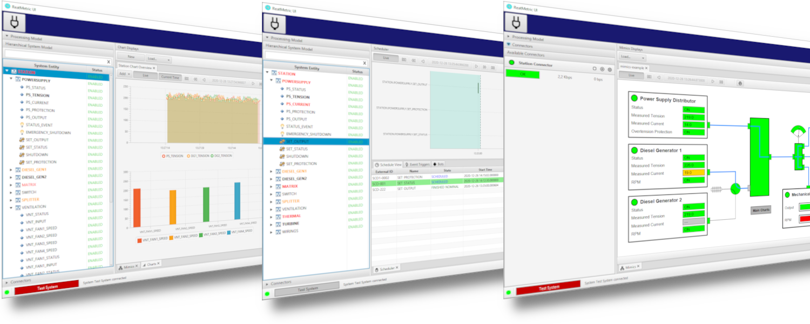
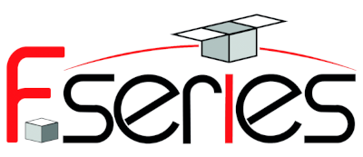

ReatMetric is a well-documented Java-based software infrastructure for the implementation of Monitoring & Control (M&C) systems.

 

## Documentation
The system concepts, design, configuration and usage are described in the [documentation](docs/ReatMetric%20System%20Manual.adoc).

As of version 1.1.0, released on 22 July 2024, the development of ReatMetric is considered completed and no further 
updates will be released.

## Dependencies
ReatMetric is based on a very limited set of dependencies:
- [openJFX](https://openjfx.io): for the graphical user interface of the _ui_ module;
- [ControlsFX](https://github.com/controlsfx/controlsfx): advanced UI controls for the _ui_ module;
- [eu.dariolucia.jfx.timeline](https://www.github.com/dariol83/timeline): providing support for schedule rendering in the _ui_ module;
- [Apache Derby](http://db.apache.org/derby): providing the storage backend of the _persist_ module;
- [JAXB](https://javaee.github.io/jaxb-v2): for the configuration of all modules;
- [Groovy](https://groovy-lang.org): for the Groovy language support in the _processing_ and _automation_ modules (best choice);
- [GraalVM](https://www.graalvm.org): for the Javascript language support in the _automation_ modules;
- [Jython](https://www.jython.org/): for the Python language support in the _automation_ modules;
- [eu.dariolucia.ccsds](https://www.github.com/dariol83/ccsds): providing support for SLE/TM/TC/PUS handling of the _spacecraft_ driver;
- [Json Path](https://github.com/json-path/JsonPath): for the parsing of JSON objects and files;
- [SNMP4J](https://www.snmp4j.org/): for the support of SNMP in the _snmp_ module;
- [PostgreSQL](https://www.postgresql.org/): providing the storage backend of the _persist.timescale_ module;
- [TimescaleDB](https://www.timescale.com/): providing the storage backend extension for the _persist.timescale_ module;

Including also the indirect dependencies, a typical ReatMetric backend deployment (i.e. without UI) is composed by 40 Jars,
16 from ReatMetric and 24 from external dependencies, for a total of **16.5 MB**. This size can be further reduced depending 
on the needs, since some drivers and related dependencies might not be needed. 

## Getting Started

### All-in-one
If you want to quickly try ReatMetric out, use the following approach:
- Build the complete tree with maven: mvn clean install
- Create a folder called 'reatmetric' inside your home folder and decompress there the configuration zip inside eu.dariolucia.reatmetric.ui.test/src/main/resources
- Update the configuration data as appropriate. There is no need to change the processing definition data
- Go inside eu.dariolucia.reatmetric.ui.test/target and run the following line (assuming Java is in your path)

(Windows)

    java --module-path="deps" -Dreatmetric.core.config=<path to ReatMetric>\configuration.xml --add-exports javafx.base/com.sun.javafx.event=org.controlsfx.controls -m eu.dariolucia.reatmetric.ui/eu.dariolucia.reatmetric.ui.ReatmetricUI

(Linux)  

    java --module-path="deps" -Dreatmetric.core.config=<path to ReatMetric>/configuration.xml --add-exports javafx.base/com.sun.javafx.event=org.controlsfx.controls -m eu.dariolucia.reatmetric.ui/eu.dariolucia.reatmetric.ui.ReatmetricUI

### With remoting
If you want to try ReatMetric using a client-server deployment, I suggest the following approach:
- Build the complete tree with maven: mvn clean install
- Create a folder called 'reatmetric' inside your home folder and decompress there the configuration zip inside eu.dariolucia.reatmetric.ui.test/src/main/resources
- Update the configuration data as appropriate. There is no need to change the processing definition data
- Go inside eu.dariolucia.reatmetric.remoting.test/target and run the following line (assuming Java is in your path)

(Windows)

    java --module-path="deps" -Dreatmetric.core.config=<path to ReatMetric>\configuration.xml -m eu.dariolucia.reatmetric.remoting/eu.dariolucia.reatmetric.remoting.ReatmetricRemotingServer 19000

(Linux)
  
    java --module-path="deps" -Dreatmetric.core.config=<path to ReatMetric>/configuration.xml -m eu.dariolucia.reatmetric.remoting/eu.dariolucia.reatmetric.remoting.ReatmetricRemotingServer 19000

- Create a folder called 'reatmetric_remoting' inside your home folder
- Inside the folder created in the previous step, create a remoting configuration, so that the UI can connect
- Go inside eu.dariolucia.reatmetric.ui.remoting/target and run the following line (assuming Java is in your path)

(Windows)

    java --module-path="deps" -Djava.rmi.server.hostname=<server IP to use for local connections> -Dreatmetric.remoting.connector.config=<path to ReatMetric remoting>\configuration.xml --add-exports javafx.base/com.sun.javafx.event=org.controlsfx.controls -m eu.dariolucia.reatmetric.ui/eu.dariolucia.reatmetric.ui.ReatmetricUI

(Linux) 
 
    java --module-path="deps" -Djava.rmi.server.hostname=<server IP to use for local connections> -Dreatmetric.remoting.connector.config=<path to ReatMetric remoting>/configuration.xml --add-exports javafx.base/com.sun.javafx.event=org.controlsfx.controls -m eu.dariolucia.reatmetric.ui/eu.dariolucia.reatmetric.ui.ReatmetricUI

Example of remoting configuration:

    <ns1:connectors xmlns:ns1="http://dariolucia.eu/reatmetric/remoting/connector/configuration">
	    <connector local-name="Test System" remote-name="Test System" host="192.168.2.106" port="19000" />
    </ns1:connectors>

## Acknowledgements and Credits
A special mention goes to Theresa Köster from the University of Gießen, who evaluated ReatMetric (among other tools) 
against the Flying Laptop operational simulator. With her contributions, ideas and suggestions, she helped greatly to 
verify the TM/TC implementation compatibility of ReatMetric against a real, operational system.

Special thanks go to the F-Series team at Airbus DS, Germany, which is using ReatMetric and the underlying CCSDS software
library as a testing system for the development support and verification of the F-Series core avionics FLP2 and FLC. The
team contributed to resolve some issues in the implementation of the protocols and provided valuable feedback for the 
improvement of the usability of the ReatMetric system.

