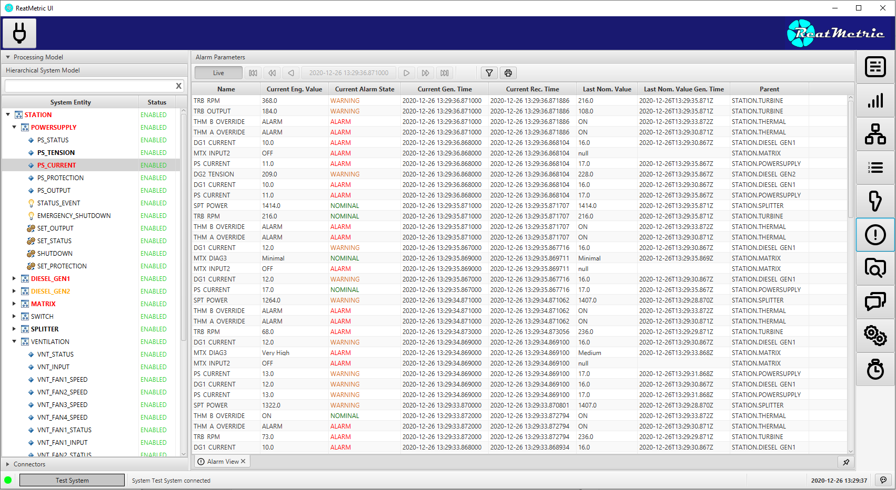
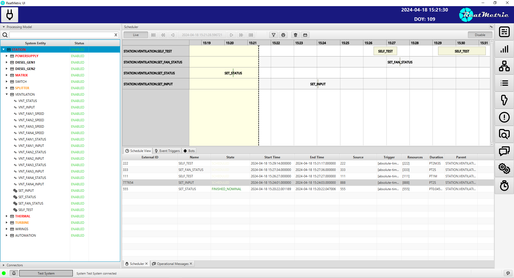

ReatMetric is a Java-based software infrastructure for the implementation of Monitoring & Control (M&C) systems, with a
strong focus on the space domain. ReatMetric components provide a simple but efficient implementation of the typical 
functions used in an M&C system.

## System Overview

### Modules
ReatMetric is a modular framework, decomposed in modules following the Java module system approach. Each module implements specific functionalities and can be _typically_ be replaced in isolation, if needed. The module definition follows a layered approach:
- **eu.dariolucia.reatmetric.api**: this module contains the interfaces that define the boundaries of the framework. Software interfacing a ReatMetric system from outside (e.g. a graphical user interface) depends on this module only at compile time. This approach allows changing the underlying implementation of the M&C functionalities without affecting external modules. In addition to the interfaces, a set of POJO objects (typically immutable) is present, as well as some utility classes.
- **eu.dariolucia.reatmetric.persist**: this module contains an implementation of the archiving interfaces as defined by the _api_ module based on Apache Derby and a file-based approach. While this implementation is suited for one-off testing and small M&C systems, its usage in large scale systems is not suggested, due to the file-based approach limitations.
- **eu.dariolucia.reatmetric.processing**: this module contains the implementation of the M&C processing capabilities at the level of parameters, events and activities. The terminology as well as the conceptual decomposition is partially derived from the ECSS standard ECSS-E-ST-70-31C: while the data definition tries to cover to the maximum possible extent the standard, the coverage is not complete in order to limit the complexity of its implementation.
- **eu.dariolucia.reatmetric.core**: this module provides an implementation of the main service specified by the _api_ module, and it has a direct dependency on the _processing_ implementation. It provides brokers for raw data distribution and message distribution and defines a lower level API for the definition of _drivers_.
- **eu.dariolucia.reatmetric.scheduler**: this module provides an implementation of the scheduler interface specified by the _api_ module. It allows scheduling (absolute time, relative time, event-based) of activities and conflict management based on resource declaration. It allows the definition of so-called bots, to execute actions depending on the values of the specified parameters.
- **eu.dariolucia.reatmetric.remoting**: this module provides the mechanism to expose an implementation of the IReatmetricSystem via Java RMI (server side).
- **eu.dariolucia.reatmetric.remoting.connector**: this module provides the mechanism to connect to a remote implementation of the IReatmetricSystem via Java RMI (client side).
- **eu.dariolucia.reatmetric.ui**: this module implements a fully featured UI (JavaFX-based) that can be used to start and operate a ReatMetric-based system.
- **eu.dariolucia.reatmetric.driver.automation.base**: this module provides a driver codebase to implement an automation system based on script files.
- **eu.dariolucia.reatmetric.driver.automation.groovy**: this module provides a driver implementation of an automation system capable to execute Groovy scripts. Preferred choice.
- **eu.dariolucia.reatmetric.driver.automation.js**: this module provides a driver implementation of an automation system capable to execute Javascript scripts. Experimental.
- **eu.dariolucia.reatmetric.driver.automation.python**: this module provides a driver implementation of an automation system capable to execute Python scripts. Experimental.
- **eu.dariolucia.reatmetric.driver.spacecraft**: this module provides a driver implementation for the monitoring and control of a CCSDS/ECSS-PUS compliant spacecraft. Currently it includes support for the reception of TM/AOS frames via SLE RAF/RCF services, TM packet extraction, parameter decoding, PUS 9 time correlation, PUS 5 event mapping, PUS 1 command verification, PUS 11 on-board command scheduling (limited to 11,4 commands), telecommand encoding and CLTU transmission via SLE CLTU, full COP-1 support.
- **eu.dariolucia.reatmetric.driver.test**: this module is a simple test driver that shows how to implement a simple custom driver.

### Dependencies
The ReatMetric modules are based on a very limited set of dependencies:
- [eu.dariolucia.ccsds](https://www.github.com/dariol83/ccsds): providing support for SLE/TM/TC/PUS handling of the _spacecraft_ driver;
- [openJFX](https://openjfx.io): for the graphical user interface of the _ui_ module;
- [ControlsFX](https://github.com/controlsfx/controlsfx): advanced UI controls for the _ui_ module;
- [Apache Derby](http://db.apache.org/derby): providing the storage backend of the _persist_ module;
- [JAXB](https://javaee.github.io/jaxb-v2): for the configuration of all modules;
- [Groovy](https://groovy-lang.org): for the Groovy language support in the _processing_ and _automation_ modules (best choice);
- [GraalVM](https://www.graalvm.org): for the Javascript language support in the _automation_ modules;
- [Jython](https://www.jython.org/): for the Python language support in the _automation_ modules.

## Functionalities

### Framework
As typical in monitoring and control software, as M&C framework (composed by the _api_, _persist_, _processing_, _core_ and _scheduler_ modules) ReatMetric can perform the following tasks:
- Monitoring data acquisition (driver-specific) from remote systems: this task is performed by means of specific drivers, which can understand the protocol exposed by the remote system and can receive the values required for its monitoring, including events generated by the remote system.
- Monitoring data processing: once the parameters are collected, they are processed according to the processing definitions defined for the processing model. The processing definition includes:
  - The capability to derive a **validity** for the collected sample. Such validity can depend on the value of another parameter or can be computed by means of an expression; 
  - The capability to transform a value (so called **calibration**). The following calibrations are supported: enumeration, range enumeration, polynomial, logarithmic, x-y with interpolation and extrapolation, expression-based, external (via plugin);
  - The capability to check a value (so called **monitoring check**). The following checks are supported: out of limit, delta increase/decrease, value equality, expression-based, external (via plugin);
  - The capability to raise **events** in case of specific conditions in the processing of a sample, or based on conditions specified by means of expressions;
  - The capability to define and process so called **synthetic parameters**, i.e. parameters whose value is computed by means of expressions.
- Monitoring data dissemination and storage: the processed monitoring data is stored into the archive for later retrieval and it is distributed, e.g. to the UI.
- Control requests: this task is perfomed by allowing the definition of control commands in a higher level of abstraction, called activities. An activity has name, arguments, properties, route:
  - The invocation of an activity is mapped to specific driver requests, which is responsible to convert the high level request into the low level command to be transmitted to the remote system, as well as to transmit it and to follow the command lifecycle as defined by the low level protocol, specific of the remote system;
  - The processing model provides a unified high level monitoring of the **lifecycle** of each activity invocation, including the capability to perform **parameter-based verification**.
- Control command and verification dissemination and storage: the activity invocations and related verification data are stored into the archive for later retrieval and distributed, e.g. to the UI.
- Scheduling of activity requests: this task is performed by a **dedicated scheduler**, which allows several possibilities:
  - Scheduling of requests to be released to the remote system at a given **absolute time**, or after a certain delay since the end of a previous set of requests;
  - **Event-based scheduling** of requests, which are released when the specific event is raised. A protection time can be specified, to avoid multiple transmissions of the same command in case of burst events;
  - **Bot-based reactions**, which allow the specification of simplified state machines, where each state is defined by a set of parameter conditions: upon entering a state, the related sequence of activities is requested;
  - **Conflict control**, based on the concept of 'resource': each scheduled request must declare the resources it needs. The scheduler makes sure that two scheduled activities cannot be release at the same time, if there is an overlap in the resources they need. Different conflict resolution strategies are available (wait, skip, abort previous).
- Generation, storage, retrieval and acknowledgement of log messages, including dedicated chat messages.

### UI
ReatMetric Graphical User Interface (composed by the _ui_ module, with optional use of the _remoting_ and _remoting.connector_ modules in case of distributed deployment) provides the following capabilities:
- Hierarchical tree-like representation of the monitored system, with indication of the processing level of each element (enabled, disabled, ignored) and the alarm state, including its propagation up in the hierarchy.
- Definition and visualisation of Alfa-Numeric Displays (ANDs), which can be constructed and stored in user-specific folders, to be reloaded in future sessions or from a mimics. Time-based navigation based on stored data is available.
- Definition and visualisation of time-based charts (line, area and bar charts for parameters, scatter chart for events), which can be constructed and stored in user-specific folders, to be reloaded in future sessions or from a mimics. Time-based navigation based on stored data is available.
- Visualisation of dynamic mimics: mimics are SVG files with embedded ReatMetric-specific attribute declarations, to link SVG items to parameter states and values. From mimics, it is possible to open ANDs, charts, other mimics, request the invocation of commands. Time-based navigation based on stored data is available.
- Parameters, events, alarms, operational messages displays. Time-based navigation based on stored data is available.
- Raw data display, including a low level inspector. Time-based navigation based on stored data is available. 
- Activity verification display. Time-based navigation based on stored data is available.
- Scheduling display. Time-based navigation based on stored data is available.
- Acknowledgement display.
- Chat display.

### Spacecraft M&C Driver
The Spacecraft M&C Driver (composed by the _driver.spacecraft_ module) provides a complete TM/TC solution for the monitoring and control of a single spacecraft. Such support is heavily based on the eu.dariolucia.ccsds library.
The driver has some limitations for what concerns the support to the Packet Utilisation Standard (ECSS-E-70-41A), since only some services are supported. Nevertheless, the driver is designed in a way that each PUS service is 
encapsulated in a single class, with no pollution or impact on the other parts of the driver. Services are registered by means of configuration: in this way, the replacement or addition of PUS services with mission-specific 
ones can be performed by updating the configuration of the driver.

The full set of capabilities of the driver:
- SLE based communication, supporting RAF, RCF and CLTU service instances;
- CLTU, TC frame and TC packet based extension points;
- CLTU encoding, AD/BD mode transmission with full COP-1 implementation;
- Space packet construction from the TC packet definition;
- AOS and TM frame processing support for space packet decoding and identification;
- PUS compliant parameter decoding according to the TM packet definition;
- Supported PUS services: 9 (time correlation), 5 (on-board events), 1 (command verification), 11 (on-board scheduling)

In order to test the driver, a simplified telemetry generator and telecommand processor (with SLE interface) has been implemented in the module _driver.spacecraft.test_. 
The simulator supports the generation of housekeeping telemetry packets, time packets, on-board events and command verifications reports. It also has support for telecommands received in AD and BD mode, BC frames and 
basic support for time-tagged commands. 

### Automation Driver

The automation drivers support 3 different languages so far, even though 2 are probably buggy:
- Groovy (the language of choice)
- Javascript (via GraalVM, which has a memory management issue, yet to be fixed)
- Python (via Jython, which presents deployment problems due to conflicting jffi artifacts in the Java module system).

The two buggy languages are encapsulated into experimental automation drivers.

### Remote Driver

The remote driver allows a hierarchical decomposition of the entire system into independent Reatmetric systems. An example 
of configuration enabling such decomposition is located in the module eu.dariolucia.reatmetric.remoting.test. Two station
simulations can be individually executed, and a high-level M&C system can connect to both systems and provide a unified 
monitoring and control experience.

The purpose of such capability is to distribute the processing across several nodes, while still being able to offer a 
common M&C view of the whole system. The high level system can reflect only a subset of the processing elements of each
sub-system. 

Moreover, the approach is scalable and not limited to a 2-tiers deployments. 

The UI module, when properly configured, allows the connection to each system with just two clicks.

The only limitation of the design is that each system entity in the overall system deployment **must have** a unique System Entity ID,
for the elements that must be accessible to any remote high-level system.

### Performance
The performance are computed with reference to the following 2 platforms:

1) Zotac Magnus EN72070V: Intel Core i7-9750H, Hexa-core, 2.6 GHz without turbo boost; 32 GB DDR4 2666 MHz; Windows 10 Professional 64 bits; openJDK 11.
2) Raspberry PI 4: Broadcom BCM2711, Quad Core Cortex-A72 (ARM v8) 64-bit SoC @ 1.5GHz, 8 GB DDR4 3200 MHz; Manjaro Linux 64 bits; openJDK 11.

Scenario 1 setup:
- Spacecraft simulator running on the same machine as the ReatMetric system;
- ReatMetric system (with UI in the same process) deployed with the Spacecraft M&C driver and the Automation driver, without the _persist_ module (no archiving);

Scenario 2 setup:
- Spacecraft simulator running on Platform 1;
- ReatMetric system (no UI) deployed on Platform 2 with the Spacecraft M&C driver and the Automation driver, without the _persist_ module (no archiving), with _remoting_;
- ReatMetric UI deployed on Platform 1.

The data definition of the processing model include:
- 80'000 processing parameters
- 5'000 synthetic parameters
- 10'000 reported events
- 2'000 condition-based events 
- 10'000 activities

The TM/TC data definition of the spacecraft include:
- 3'600 3,25 TM packets
- 10'000 5,[1,2,3,4] TM packets
- time packet, verification reports
- 10'000 TC commands 

TM/TC setup:
- single RAF SLE in online timely mode;
- single CLTU SLE;
- TM frame: 1115 bytes with CLCW, no FEC;
- TM packets: with packet CRC.

Scenario 1 results:
- Processing start-up time (as per logs - first run, no cache): 26 seconds
- Processing start-up time (as per logs - with cache): 10 seconds
- Max TM rate: 23.1 Mbit/sec (SLE TML level - RAF complete mode - processing backpressure propagated to the data generator)
- Nb. of TM frames per second: ca 2.300/sec
- Nb. of TM packets per second: ca 8.000/sec
- Nb. of TM parameter samples decoded per second: ca 435.000/sec
- Nb. of processed items generated per second: ca 530.000/sec
- Memory usage (heap size): between 2 and 4 GB, Windows reports 5 GB 
- CPU load: between 35% and 45% (equivalent of almost 6 cores fully utilised)

Scenario 2 results:
- Processing start-up time (as per logs - first run, no cache): 113 seconds
- Processing start-up time (as per logs - with cache): 56 seconds
- Max TM rate: 4.6 Mbit/sec (peak: 7 Mbit/sec, no backlog: 2.5 Mbit/sec)
- Nb. of TM frames per second (peak): ca 450/sec, no backlog 250/sec
- Nb. of TM packets per second (peak): ca 1270/sec, no backlog 900/sec
- Nb. of TM parameter samples decoded per second (peak): 70.000/sec
- Nb. of processed items generated per second (peak): 100.000/sec 
- Memory usage server (heap size): between 2 and 4 GB, top reports 4.6 GB (capped with -Xmx4G)
- Memory usage UI (Windows Task Monitor): 1.6 GB
- CPU load server: between 320% and 350% (all 4 cores above 80%)
- CPU load UI: 3-5% (equivalent to a single core 70% utilised)

## Getting Started

### All-in-one

If you want to quickly try Reatmetric out, I suggest the following approach:
- Build the complete tree with maven: mvn clean install
- Create a folder called 'reatmetric' inside your home folder and decompress there the configuration zip inside eu.dariolucia.reatmetric.ui.test/src/main/resources
- Update the configuration data as appropriate. There is no need to change the processing definition data
- Go inside eu.dariolucia.reatmetric.ui.test/target and run the following line (assuming Java is in your path)

(Windows)
java --module-path="deps" -Dreatmetric.core.config=path to Reatmetric\configuration.xml --add-exports javafx.base/com.sun.javafx.event=org.controlsfx.controls -m eu.dariolucia.reatmetric.ui/eu.dariolucia.reatmetric.ui.ReatmetricUI

(Linux)  
java --module-path="deps" -Dreatmetric.core.config=path to Reatmetric/configuration.xml --add-exports javafx.base/com.sun.javafx.event=org.controlsfx.controls -m eu.dariolucia.reatmetric.ui/eu.dariolucia.reatmetric.ui.ReatmetricUI

### With remoting

If you want to try Reatmetric using a client-server deployment, I suggest the following approach:
- Build the complete tree with maven: mvn clean install
- Create a folder called 'reatmetric' inside your home folder and decompress there the configuration zip inside eu.dariolucia.reatmetric.ui.test/src/main/resources
- Update the configuration data as appropriate. There is no need to change the processing definition data
- Go inside eu.dariolucia.reatmetric.remoting.test/target and run the following line (assuming Java is in your path)

(Windows)
java --module-path="deps" -Dreatmetric.core.config=path to Reatmetric\configuration.xml -m eu.dariolucia.reatmetric.remoting/eu.dariolucia.reatmetric.remoting.ReatmetricRemotingServer 19000

(Linux)  
java --module-path="deps" -Dreatmetric.core.config=path to Reatmetric/configuration.xml -m eu.dariolucia.reatmetric.remoting/eu.dariolucia.reatmetric.remoting.ReatmetricRemotingServer 19000

- Create a folder called 'reatmetric_remoting' inside your home folder
- Inside the folder created in the previous step, create a remoting configuration, so that the UI can connect
- Go inside eu.dariolucia.reatmetric.ui.remoting/target and run the following line (assuming Java is in your path)

(Windows)
java --module-path="deps" -Djava.rmi.server.hostname=server IP to use for local connections -Dreatmetric.remoting.connector.config=path to Reatmetric remoting\configuration.xml --add-exports javafx.base/com.sun.javafx.event=org.controlsfx.controls -m eu.dariolucia.reatmetric.ui/eu.dariolucia.reatmetric.ui.ReatmetricUI

(Linux)  
java --module-path="deps" -Djava.rmi.server.hostname=server IP to use for local connections -Dreatmetric.remoting.connector.config=path to Reatmetric remoting/configuration.xml --add-exports javafx.base/com.sun.javafx.event=org.controlsfx.controls -m eu.dariolucia.reatmetric.ui/eu.dariolucia.reatmetric.ui.ReatmetricUI

Example of remoting configuration:

    <ns1:connectors xmlns:ns1="http://dariolucia.eu/reatmetric/remoting/connector/configuration">
	    <connector local-name="Test System" remote-name="Test System" host="192.168.2.106" port="19000" />
    </ns1:connectors>

## Implement your driver

## Roadmap
- Implementation of a serial-USB driver to interface an Atari Portfolio (https://en.wikipedia.org/wiki/Atari_Portfolio) for parameter/messages/events visualisation (I know, it is pretty useless in practice, but I want to learn how to handle USB ports using Java, and demonstrate that it is possible to have something that works and it is optimised to interface hardware that is more than 30 years old)
- Optimisations and features for the JavaFX UI
- Alternative _persist_ implementations (server-based - in addition to file-based - Apache Derby, PostgreSQL)
- Web interface (at some point)

## Acknowledgements and Credits

