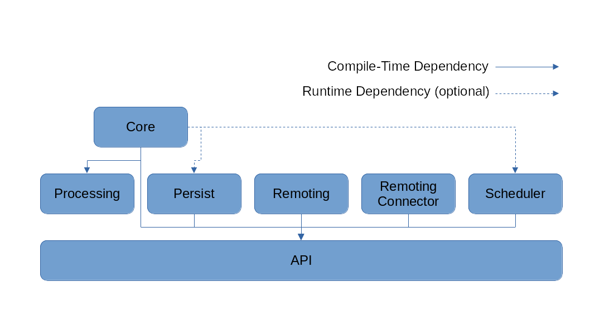

= ReatMetric Design & Concepts
Dario Lucia <dario.lucia@gmail.com>
:toc:
:homepage: https://github.com/dariol83/reatmetric

== System Overview
ReatMetric is a Java-based software infrastructure for the implementation of Monitoring & Control (M&C) systems,
with a strong focus on the space domain. ReatMetric components provide a simple but efficient implementation of the
typical functions used in an M&C system.

=== Introduction

A Monitoring and Control (abbreviated as M&C) system is an application used to:

* retrieve and process information of the status of hardware and software devices in a given context,
* allow control and commanding of such devices,
* present such information to human users, operators and other software systems,
* detect non-nominal situation and raise alarms accordingly,
* schedule operations and activities to be executed on the devices,
* record the most important data for later analysis.

ReatMetric is designed as a modular M&C framework, whereas each module follows the Java Platform Module System
(https://en.wikipedia.org/wiki/Java_Platform_Module_System). Each module provide a specific set of functionalities,
data structures and interfaces that can be used by other modules. While some modules provide data structures and
interfaces that are at the foundation of the framework, other modules can be replaced in isolation.

The modules that form the foundation of the ReatMetric system are shown in the following figure.

=== Monitoring and Control Concepts

In the ReatMetric world, the environment to be monitored and controlled is seen as a hierarchical decomposition,
starting from a top level object, further decomposed into groups, systems, sub-systems, devices and so on. For instance,
the monitoring of a domotic system for a home automation system could be hierarchically arranged as follows:

* My house
** Blinders
*** Bedroom 1
**** Window Roller 1
***** Engine (device)
***** Control Panel (device)
**** Window Roller 2
***** ...
*** Bedroom 2
**** Window Roller
***** ...
*** Kitchen
**** Window Roller
***** ...
*** Bathroom
**** Window Roller
***** ...
** Appliances
*** Kitchen
**** Dishwasher (device)
**** Oven (device)
**** Microwave (device)
**** Fridge (device)
*** Bathroom
**** Washing Machine (device)
**** Dryer (device)
*** ...
** Heating System
*** ...
** Light System
*** ...
** Network
*** ...

The arrangement of the hierarchy is sometimes obvious to design, while in other cases can be more a matter of taste. In
the example above, for instance, the hierarchy is a functional hierarchy, based on the functional elements present in
the domotic system. However, a hierarchical breakdown based on the rooms of the house could have been an alternative.
What it is not a matter of taste are the physical objects (labelled as 'device'), which are ultimately monitored and
controlled. Such objects are characterised by having:

* A readable state - i.e. a set of _parameters_ - with related values, which you can actively monitor and, in some cases,
also change. For instance, a television has the following state parameters: if it is on or off, selected input source,
selected program, current volume, if is muted or not, version of the installed firmware... Some parameters can be also
set (e.g. changing the program or muting/unmuting the device), while some others are read-only (e.g. the version of the
installed firmware).
* A commanding interface - i.e. a set of defined _activities_ - that specify what you can do with the device. For
instance, an oven can have a way to request the start of the self-cleaning. Depending on the protocol exposed by the
device, the lifecycle of activity executions can be monitored (e.g. the device informs that the operation has been
accepted and, after a while, that the operation has been completed - with success or with error).
* A way to signal when something happened - i.e. an _event_ - which is relevant for the functioning purpose of the device.
For instance, a television might signal when a new version of the firmware is detected.

ReatMetric concepts are derived as described above. As it is a M&C framework oriented to the space domain, such concepts
are a re-elaboration of the M&C concepts reported in the ECSS standard ECSS-E-ST-70C
(https://esastar-publication.sso.esa.int/api/filemanagement/download?url=emits.sso.esa.int/emits-doc/ESOC/1-6223/ECSS-E-ST-70-31C(31July2008).pdf).
ReatMetric manages a hierarchical tree composed of so-called _System Entities_. A _System Entity_ (at any level of the
hierarchy) is characterised by _parameters_, _activities_ and _events_. Some system entities are mapped to actual devices,
while others are introduced only as 'containers', to partition large systems in subsystems.

=== Parameters
A _parameter_ is a property containing a value. A parameter defines a so-called raw type and an engineering type:

* The raw type is the type of the value that will be reported for that parameter, for further processing. For instance,
the status of the mute/unmute parameter of a television might be reported by the television interface as 0 if the TV is
muted, and 1 if it is unmuted. In such case, the raw type of the 'muted status' parameter is an unsigned integer. The
value as reported by the TV takes the name of _source value_.
* The engineering type is the type of the value that will be reported after the processing. For instance, it might be
desirable to have a mapping between the value 0 to the string 'MUTED' and the value 1 to the string 'UNMUTED'. The
function mapping the source value to the engineering value takes the name of _calibration function_.

The value of a parameter might be considered valid depending on certain conditions. For instance, the current value of
the TV volume level should be irrelevant, if the TV is muted. The parameter mapping the TV volume level will have
therefore a _validity condition_, linked to the parameter value of the mute/unmute parameter. Parameters that are not
valid are not calibrated.

Each parameter may define a set of _monitoring checks_, i.e. conditions that are evaluated again the engineering value of the
parameter every time a new engineering value of that parameter is available. If the value is not satisfying the defined
check, the parameter _alarm state_ will change to a non-nominal state. Each check may define an applicability condition,
which is evaluated to understand if the related check must be verified or not. Parameters that are not valid are never
checked.

There is a type of parameters, for which the _source value_ is not retrieved by devices, but it is computed internally
by ReatMetric, based on an arithmetic/algorithmic expression. Such parameters are called _synthetic parameters_: the
source value of synthetic parameters is recomputed every time one of the dependant parameters is updated.

=== Activities
An _activity_ is the definition of an operation that can be performed by a given system entity. It is an abstract
representation of an action.

An activity is characterized by a set of named arguments, each having a raw type and an engineering type. As per
parameters, a de-calibration function may be present for each argument, to convert the argument value provided as
engineering value into a source value, which is then provided to the underlying layer that implements the execution of
such activity. Properties can also be defined.

Once invoked, an _activity occurrence_ is created and dispatched to the specific ReatMetric driver for implementation.
Upon its creation, an activity occurrence starts its lifecycle. Such lifecycle in ReatMetric is defined by the following
_states_:

* CREATION: this state is assigned upon creation of the activity occurrence.
* RELEASE: this state is reached when the activity occurrence is prepared for release.
* TRANSMISSION: this state is reached as soon as the activity occurrence leaves the ReatMetric system.
* SCHEDULING: this state is reached when the activity occurrence will be executed by the final destination at a given
point in time.
* EXECUTION: this state is reached when the activity occurrence is under execution by the final destination
* VERIFICATION: this state is reached when the effects of the activity occurrence can be verified at parameter level in
the ReatMetric processing model.
* COMPLETED: this state is reached when no further state updates are expected. The activity occurrence lifecycle is
considered complete.

In order to transition from one state to the other, _verification stages_ about the progress of the activity occurrence
are announced to the ReatMetric processing model, internally by ReatMetric itself and by the specific driver that
manages the implementation of the activity occurrence. A verification stage can be considered as a concrete step in the
progress of an activity occurrence. Each verification stage is announced and further updated by means of _reports_.
Typically, such reports depend on the way the transmission protocol is defined and in the specific lifecycle of the
activity implementation. Each report specifies: the name of the verification stage, the activity state it belongs to;
the estimated/exact execution time of the activity occurrence; the activity state the activity occurrence shall
transition to, upon processing the report (if the report is successful); an optional result.

The report of a verification stage can have one of the following states:

* UNKNOWN: The stage state is unknown and no better prediction can be done
* EXPECTED: The stage should be concluded, but no confirmation of the stage was received yet
* PENDING: The stage is reported as currently open and the system is waiting for its confirmation
* TIMEOUT: The timeout linked to the stage expired
* OK: The stage is reported as successfully executed
* FAIL: The stage is reported as failed, but this failure is not fatal for the execution of the activity occurrence
* FATAL: The stage is reported as failed, the activity occurrence shall be considered completed
* ERROR: This specific state is reported in relation to a verification expression, linked to the activity occurrence
state VERIFICATION when the expression cannot be evaluated due to expression's errors

An important state of an activity occurrence lifecycle is represented by the VERIFICATION state: in such state,
ReatMetric will evaluate a specific expression. Such expression, if defined, is based on parameters and activity
occurrence arguments, and it is used to verify that the effects of the activity occurrence execution are actually
visible in the monitored system, regardless of any execution report possibly generated by the end system.

=== Events
An _event_ is used to indicate the occurrence of a situation. Differently from activity occurrences and parameters,
events do not have a state as such, because their lifetime is, theoretically speaking, istantaneous. For instance, an
event could be raised by a television to indicate the presence of a new firmware version. It could be that the same
information is delivered by a parameter as well (e.g. a parameter named "Latest available firmware version"): the change
in value of this specific parameter triggers the event. In more correct terms, the object generated by ReatMetric should
be called _event report_ rather than just _event_: the terminology has been used to align it to the ECSS standard.

An event has a qualifier and a source, and it is defined by a severity and a type. Events in ReatMetric can include a
generic report object, which contains additional information about the raised event.

In ReatMetric events can be reported by the drivers (so-called _reported events_), or can be detected autonomously by
the ReatMetric processing model, by evaluating conditions upon change of parameters (so-called _TM-based events_).

=== Connectors, activity handlers and routes
In order to receive data from monitored devices and to send commands to such devices, ReatMetric needs to establish data
connections to them. Typically, a device allows a connection using a specific network/transport protocol, which is used
to exchange data using an application protocol. For instance:

- you can connect using a TCP/IP connection, which it is used to exchange binary or ASCII-based Protocol Data Units (PDUs);
- you can connect using a TCP/IP connection, which it is used to exchange HTTP(s) requests/responses;
- you can query the device using SNMP GET requests and send commands via SNMP SET requests;
- you can connect via a serial port, which it is used to exchange binary or ASCII-based PDUs.

The way of connecting and exchanging messages to the device is device-dependent. Even the number of connections is
device-dependent. Some devices might deliver monitoring data using a TCP/IP port and receive control requests and
commands using a separate TCP/IP port.

In ReatMetric, a _connector_ is used to represent and manage a logical connection between the ReatMetric system and the
target device. For every device, you may have one or more connectors. Via the connector interface, you can start, stop,
abort, initialise and monitor the logical connection to the target device. A logical connection can be mapped to a
single physical connection to the device, or to multiple physical connections, even to different devices.
This depends on the way the support to the device is implemented (see section <<_drivers>>).

The state of a logical connection determines the availability of a so-called _route_. A route is a uniquely identified
path from the ReatMetric system to the target device. Every parameter or event received from a given route reports also
the incoming route as part of its state. In the same way, when an activity occurrence is dispatched to an _activity
handler_, the outgoing route must be indicated. If the route, whose state is reported by the corresponding activity handler,
is not available, then the dispatch of the activity occurrence fails.

Even if there is typically a logical link between a _connector_ and a specific _route_, this link is not enforced by
ReatMetric directly. In fact:

- A connector can manage one or more logical connections;
- A logical connection is mapped to zero or more physical connections;
- A route is declared as managed by one activity handler;
- An activity handler manages one or more routes;
- A route can be logically mapped to one or more logical connections by the activity handler that manages the route.

For the ReatMetric architecture, all this management happens inside the so-called _drivers_ (see section <<_drivers>>).

=== Raw Data
In ReatMetric, a _raw data_ is an semi-opaque data object, with the meaning that ReatMetric does not know the internal
structure or data of the object, but only some meta-data attributes, such as the originating source, the route, the
generation and reception time, and so on. Any module in the ReatMetric architecture can store and retrieve _raw data_.

For instance, _raw data_ can be used to distribute and optioanlly store low level PDUs that are exchanged at connection
level between ReatMetric and the target devices. In the same way, it can be used to store changes of state or internal
states of modules and drivers, as required.

=== ReatMetric Main Interface

=== Drivers
A _driver_ is the object that connect ReatMetric with an external device or system. A driver is responsible for:

- Managing and providing a set of activity handlers, which are the entry point for activity dispatching by the ReatMetric
system;
- Managing and providing a set of connectors, which are used to manage the connections between ReatMetric and the external
device or system;
- Managing the specific protocols and formats to retrieve parameters and events from the external device or system, and
ingest such data into the ReatMetric processing model;
- Managing and providing the raw data interpreters, i.e. renderers that can be used to display raw data internals, as
made visible by the driver;
- Providing internal state information, for debug and monitoring purposes.

The lifecycle of a driver is pretty simple:

- A driver is instantiated and initialised by the ReatMetric Core module, by invoking the initialise(...) method. This
method contains several arguments, among others the name and configuration of the drivers, and the _context_ of the
ReatMetric Core instance.
- The driver is enquired to know the available activity handlers, raw data renderers and transport connectors. Each of
this elements is then used accordingly by the relevant ReatMetric modules, i.e. the activity handlers are used by the
processing model when dispatching activity occurrences; the renderers are used by the MMI; the transport connectors are
used by the ReatMetric Core and by the MMI to activate and manage the external connections.
- At ReatMetric Core instance shutdown, the dispose() method is invoked, to perform clean-up activities and to release
the resources.

Once a driver is disposed, it is never re-used. Therefore, the initialise(...) and dispose() methods are called only
once during a single ReatMetric Core instance lifecycle.

In the initialise(...) method, a reference to a context object is provided. Such object allows the driver to reach the
different functions made available by the ReatMetric system:

- The archive, if available;
- The scheduler, if available;
- The processing model;
- The raw data broker;
- The operational message broker;
- The ReatMetric system main interface.

== Foundation Modules

=== API
The eu.dariolucia.reatmetric.api module provides the definition of all interfaces and data structures that are used by
ReatMetric and exposed to the 'outside world'. Unless you are coding a driver, importing this module ensures that all
ReatMetric interfaces and data structure are available for you to use. For instance, the MMI implementation provided
by the eu.dariolucia.reatmetric.ui module depends only on this module and not on a specific ReatMetric implementation.

The facade interface to a ReatMetric system is specified by the IReatMetricSystem Java interface: such interface
provides all necessary methods to initialise, access and dispose ReatMetric functions. An implementation of such
interface is provided by the eu.dariolucia.reatmetric.core module.

Each class in this module is provided with Javadocs, to help developers in the understanding of the ReatMetric API.

This module has no internal or external dependencies.

=== Processing
The eu.dariolucia.reatmetric.processing module provides an implementation of the IProcessingModel interface specified in
the API module. Such model defines the M&C structure of the system(s) monitored by ReatMetric, in terms of system
elements, parameters, events, activities.

Upon loading the definitions of the model, this module builds a graph of dependencies across the various entities, in
order to understand which entity state needs to be recomputed, when another entity state changes. For instance, synthetic
parameters defined by expressions are recomputed only upon change of their input parameters. With the derivation of the
topological ordering of the entities, it is ensured that the number of entity state recomputations is only one per set of
updates.

In addition, the graph is used to determine when two requests for parameter/event updates can be processed in parallel,
because there is no processing overlap between the two requests. For instance, if two set of parameter updates are
provided at the same time (e.g. since they come from the monitoring of two separate devices), then the processing will
be performed in parallel by two different execution threads. Of course, this happens only if there is no 'shared entity'
affected by the two updates. For instance, if a synthetic parameter is defined, having parameters coming from two
different devices as input parameters, then the updates will be serialised due to the synthetic parameter presence.

Since the topological ordering is an expensive operation, the module might create a cache the first time this ordering is
computed, generating a file named ".ordering.cache", and reuse this cache every time the model is loaded again.

In terms of activity dispatching, activity handlers need to be registered to the processing model implementation via
the methods defined in the IProcessingModel interface. At registration time, the processing model enquiries the activity
handler about the supported routes and keeps a correspondence between the route and the activity handler. An activity
handler also reports which type of activity it supports. The type is a simple string and it must be assigned to each
activity in the processing definition.

All state updates generated by the processing model are sent to a single sink: this approach is not specified by the
IProcessingModel interface, but it is a characteristic of this implementation.

This module has one internal dependency:

* On eu.dariolucia.reatmetric.api

This module has two external dependencies:

* On JAXB library, since the processing definitions are defined in XML files;
* On Groovy library, since expression-based checks, expression-based calibrations, parameter-based verifications for
activities and synthetic parameters/events are defined using Groovy as scripting language.

=== Persist
The eu.dariolucia.reatmetric.persist module is the implementation of a storage system for ReatMetric data such as parameters,
events, activity occurrences, raw data and operational messages. The implementation is based on the Apache Derby RDBMS,
and it can be used in file-based and client-server deployments, depending on the way the argument "archiveLocation" is
provided:

* If the path to a folder is provided, then the file-based archive is used;
* If a '//<server>[:<port>]/<databaseName>[;user=<value>;password=<value>[;...]]' string is provided, then a client
connection to the server is established. The server must have been already started in advance.

Including this module in a ReatMetric system is not mandatory: if not present, the system will work as usual, but it will
not store any data. In the same way, it will not be possible to retrieve any historical data, but only monitor the live
state of the external devices/systems.

This module can be deployed outside a ReatMetric system, if a means to access the stored data outside the ReatMetric
system is desirable, keeping in mind that:

* File-based archives can be accessed only by a single system at once;
* Archives in a client-server deployment can be accessed in parallel by more than a single system.

This module has one internal dependency:

* On eu.dariolucia.reatmetric.api

This module has one external dependency:

* On Apache Derby.

=== Scheduler
The eu.dariolucia.reatmetric.scheduler module provides the implementation of a scheduler with three main functionalities:

* Schedule activity executions with time-related triggers (absolute time, relative time to other scheduled activities
with optional delay);
* Schedule activity executions with event-related triggers, i.e. activities that are dispatched when a specific event is
raised by the processing model;
* Schedule activity executions based on state machine transitions (called 'bots').

For all these types of scheduling strategies, the ReatMetric scheduler handles resources and conflicts:

* When a schedule request is sent to the scheduler via the load(...), schedule(...) or update(...) method, the request
must have a set of resources linked to it. From a scheduling point of view, a resource is simply a string, identifying
the resource. The set of resources can be empty: this means that the scheduled activity does not declare any resource as
needed for its execution.
* A conflict can materialize:
** At insertion time: each insertion/update method for scheduling request foresees the provision of a CreationConflictStrategy
specification (an enumeration): such strategy tells the scheduler what to do in case of conflict.
** At execution time: each scheduling request must provide an indication of what to do, when the scheduled activity should
be triggered, but one of the declared resources is declared by a different scheduled activity that is currently running.

The CreationConflictStrategy can be applied only for the scheduling of activities whose scheduling
trigger is time-related:

* ABORT: Abort the complete operation if there is a resource conflict: the schedule is unmodified
* SKIP_NEW: Do not add the new activity if a resource conflict exists
* REMOVE_PREVIOUS: Remove the resource-conflicting scheduled items before adding the new activity
* ADD_ANYWAY: Add the activity anyway, with the risk of having problems later

The ConflictStrategy, defined per scheduling request or activity invocation (in case of bots), is applied to all activities
that are triggered and should start the execution:

* WAIT: Wait until the latest invocation time (if present) or indefinitely (if not present). Start as soon as the resources
are freed.
* DO_NOT_START_AND_FORGET: Do not invoke the activity and forget about its execution. The activity is basically skipped.
* ABORT_OTHER_AND_START: Abort ALL activities that are holding up the required resources, and then start the activity.

If the scheduled activity is triggered to start and the declared resources are available, the resources are acquired and
the activity is requested to the processing model to be dispatched.

Even if there is no compile-time dependency, the Scheduler implementation of this module requires an implementation of
several ReatMetric interfaces, in order to be instantiated and started.

The introduction to the so-called 'bots' require an ad-hoc paragraph. Bots are used to request automated activity
invocations depending on changes of state of the monitored systems. Each bot contains a formalized description of the
different states of interest of a system, in the form of a list of states. Each state contains:

* A list of criterium targeting a parameter, each of them evaluating to a boolean: true or false;
* A list of activities to be invoked.

When the bot is initialised, it will go through the defined states one by one, according to the definition order, and it
will evaluate each criterium of the state. If the criteria defined for a specific state are all evaluated to true, the
bot state is assigned to that state and it stops evaluating the remaining states. The actions assigned to the new state
are executed, if the bot is configured to do so (BotProcessingDefinition executeOnInit set to true).

When any of the monitored parameters in the list of criterium for all states change, the bot will evaluate again the
criteria defined for the current state. If all criteria evaluate again to true, there will be no change in the state.
Otherwise, the bot will start again evaluating the states one by one, according to the definition order, until it will
find a new matching state and perform the transition. If there is no matching state, no transition will be performed.

The function can be better understood with an example. Let's assume that a device is powered up by three independent power
supplies (a primary and two emergency power supplies, selected by a switch) on two inputs, for redundancy purposes.
The input to be used to power up the internal battery must be selected

=== Core

=== Remoting

=== Remoting Connector

== Driver Modules

=== Automation

=== HTTP Server

=== Remote

=== Spacecraft

=== Serial

== User Interface

== Extending ReatMetric

=== Implement a new driver

=== Generate a new custom package

