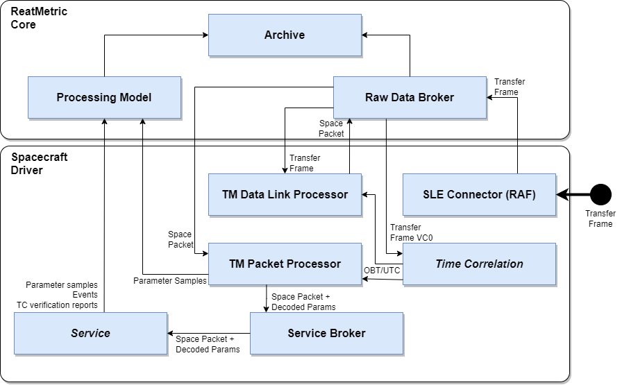
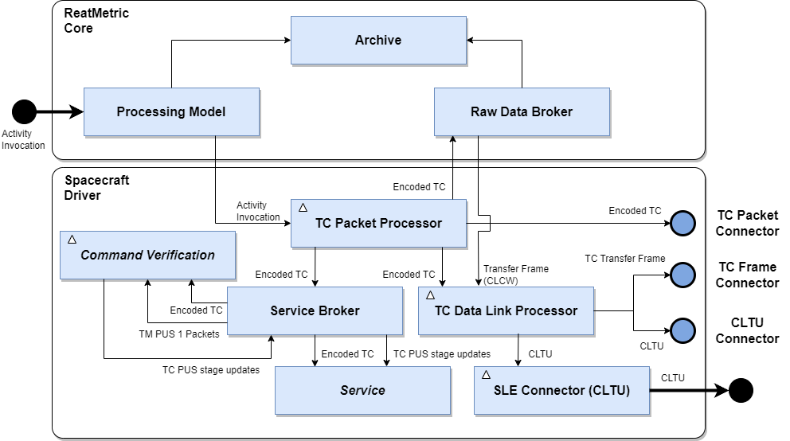
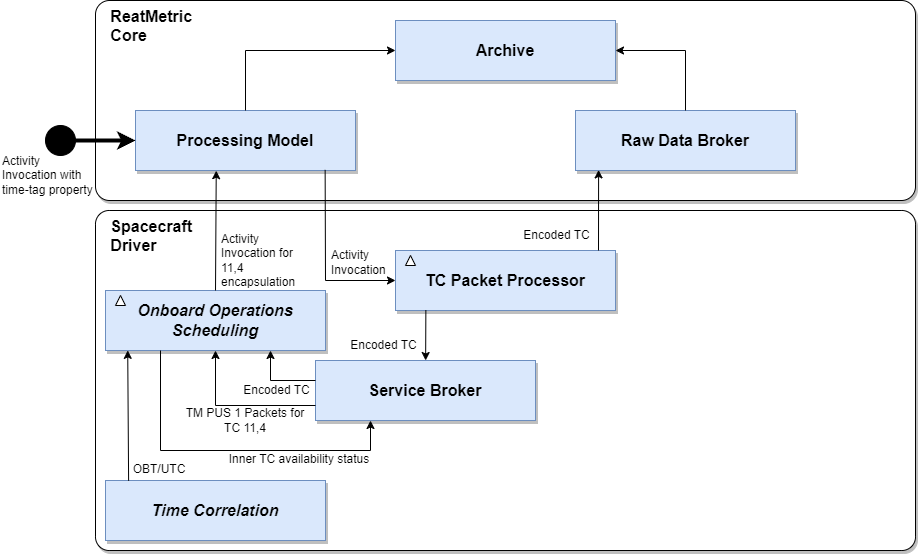

==== Overview
The eu.dariolucia.reatmetric.driver.spacecraft module provides a driver that allows the processing of telemetry data and
the sending of telecommand to satellites compliant to the CCSDS (http://www.ccsds.org) standards.

Being a driver, a _spacecraft_ module must be registered as such in the system Core's configuration.

As it must be able to support primarily by configuration the basic monitoring and control of CCSDS-compliant satellites,
the driver configuration and design are overall complex and require preliminary knowledge of CCSDS and ECSS standards.
Nevertheless, by breaking down the configuration and the design smaller pieces, such complexity can be managed. The
information provided in this document allows to understand the fundamentals of the design of the driver, without pretending
to be an exhaustive guide to satellite monitoring and control.

==== Design
===== Telemetry
The telemetry processing chain is composed by the following processing entities:

. Interface that are able to receive TM data from the spacecraft by means of _connectors_. The spacecraft
driver implements the support for CCSDS SLE RAF (Return All Frames) and RCF (Return Channel Frames) protocols. These
protocols deliver TM or AOS Transfer Frames to the ReatMetric Raw Data Broker, for further dissemination and processing.
Additional interfaces can be added by leveraging the driver extensions (see <<_command_connectors>>). De-randomisation is also
performed by this entity, if configured.
. A _TM Data Link Processor_ that is subscribed to the Raw Data Broker for TM or AOS transfer frames (as defined in the driver
configuration) and extracts TM packets from the transfer frames. If the security layer is configured, this entity also
makes sure to decrypt the frame before extracting the TM packets. Extracted TM packets are identified according to the
packet definitions defined as part of the driver configuration, time-correlated with the currently availabile time correlation
coefficients, and forwarded to the Raw Data Broker for further dissemination and processing.
. A _TM Packet Processor_ that is subscribed to the Raw Data Broker to TM packets and decodes the TM parameters contained
in each packet according to the packet structure definition defined as part of the driver configuration. The extracted
TM parameters are time-correlated (depending on the structure definition of the packet) and mapped to ReatMetric's
processing model parameters and injected into the processing model for processing (validity checking, calibration,
alarm checking). Each TM packet together with the extracted TM parameters is also forwarded to the _Service Broker_.
. The _Service Broker_ is an entity responsible to distribute TM packets and telecommand (both TC packets and VC data units)
lifecycle information to so-called _services_, as well to act as a registry for some specific internal interface implementations.
A _service_ in this context has the same meaning of that defined by the ECSS Packet Utilisation Standard. The driver provides
basic (and sometimes partial) implementations of the following services, but the service support can be extended by means
of extensions and the provided implementations easily replaced (see <<_services>>):
.. Time service (PUS service 9), responsible for time correlation with a linear regression implementation;
.. On-board event service (PUS service 5);
.. On-board operations scheduling service (PUS service 11), with limited support to 11,4 telecommands: only one inner TC) and
no support for (11,1), (11,2) and status reports;
.. Command verification service (PUS service 1).

===== Telecommand
The telecommand processing chain is composed by the following processing entities:

. A _TC Packet Processor_ that is an _Activity Handler_ of the ReatMetric processing model: when an activity is invoked, and
this activity is mapped to a telecommand packet or to a VC data unit (depending on the telecommand definition),
the corresponding activity occurrence is forwarded to this element. This element encodes the telecommand, forwards it to
the Raw Data Broker and to the _Service Broker_. If there is a service that fully takes over the processing of the telecommand
(e.g. the on-board operations scheduling service), then the TC Packet Processor does not perform any additional processing.
If instead there is no service taking over the processing of the telecommand, then the TC Packet Processor, depending on
the selected route, might forward the telecommand to an external, TC packet-based interface (in case of TC packets)
or to the TC Data Link Processor.
. A _TC Data Link Processor_ that receives TC packets and VC data units, and constructs TC frames out of them. This entity
also manages the COP-1 protocol for all the possible TC VC IDs, as specified in the configuration. Selection of the AD/BD mode,
segmentation, MAP-ID and grouping is achieved by configuration, and it can be overridden using the _activity properties_
described further on. Depending on the selected route, the TC Data Link Processor forwards the TC frame to an external,
TC frame-based interface or to an external, CLTU-based interface. In the latter case, this entity takes care of encoding
the CLTU. Randomisation is also performed by this entity, if configured.
. Interfaces that are able to send telecommands in TC packet, TC frame or CLTU form by means of _connectors_. The spacecraft
driver implements the support for CCSDS SLE CLTU protocol, as well as for a simple TCP/IP CADU/CLTU connection.

An important aspect related to telecommand handling is the management of telecommand verification. ReatMetric Spacecraft
driver defines a telecommand lifecycle, partitioned in _phases_, mapped to the ReatMetric processing model activity lifecycle:

. *ENCODED*: the telecommand is encoded and announced as such to the service broker, so that all services involved in the telecommand
handling are aware that a new telecommand is encoded and ready to be released (but not released yet).
. *RELEASED*: the telecommand is possibly encoded into a TC frame (and possibly in a CLTU) and sent for release.
The service broker is informed that the telecommand left the ReatMetric system and it is on its way to the satellite. In case
of SLE CLTU being used, this phase corresponds to the reception of a positive CLTU-TRANSFER-DATA confirmation by the ground
station or intermediate system. Other interfaces (e.g. TCP/IP CADU/CLTU connection) might report this phase if the connection is
active and if it was possible to write the telecommand (including its envelope, i.e. TC frame/CLTU) to the connection.
The linked activity occurrence is in TRANSMISSION.
. *UPLINKED*: the telecommand has been transmitted from the ground station or intermediate system to the satellite. In case
of SLE CLTU being used, this phase corresponds to the reception of an ASYNC-NOTIFY operation, reporting the radiation of the
CLTU. Other interfaces (e.g. TCP/IP CADU/CLTU connection) might report this phase if the connection is
active and if it was possible to write the telecommand (including its envelope, i.e. TC frame/CLTU) to the connection. This
behaviour is obviously protocol- and intermediate system-dependant. The linked activity occurrence is in TRANSMISSION.
. *RECEIVED_ONBOARD*: the telecommand is assumed or confirmed to be received on-board. In case of telecommand dispatch in
TC frames using AD mode, this information is reported by the FOP-1 engine. In case of BD mode, the propagation
delay, as defined as part of the driver configuration, is taken into account to announce the _expected_ reception of the
telecommand on-board. It must be kept in mind that this phase simply means that the telecommand should be at the satellite:
it does not mean that the telecommand is in the availability of the on-board software for execution. In fact, this depends
whether the telecommand is for direct execution or if it is for later, scheduled execution (in PUS terms, it is wrapped
in a PUS 11,4 telecommand). The linked activity occurrence is in TRANSMISSION.
. *SCHEDULED*: the telecommand is scheduled on-board for future execution. In the current driver implementation, this phase
is announced by the On-board Operations Scheduling service, upon completion of the containing 11,4 telecommand.  The linked
activity occurrence is still in TRANSMISSION.
. *AVAILABLE_ONBOARD*: the telecommand is assumed to be in the availability of the on-board software for immediate execution.
This phase is announced by the PUS 1 service immediately after the RECEIVED_ONBOARD phase for immediate telecommands, or by
the PUS 9 service after the SCHEDULED phase for time-tagged commands. The announcement of this phase triggers the
Command Verification service to register the telecommand and start processing incoming PUS 1 TM packets, to receive and
process the PUS 1 reports related to the telecommand.  The linked activity occurrence is in EXECUTION.
. *STARTED*: the telecommand is started its on-board execution. This phase is announced by the Command Verification service upon
reception of the related PUS START success report (1,3). There is no such verification for VC data units telecommands.
. *COMPLETED*: the telecommand completed its on-board execution. This phase is announced by the Command Verification service upon
reception of the related PUS COMPLETED success report (1,7), or by any success report that is marked to be the last expected
PUS report linked to the telecommand. There is no such verification for VC data units telecommands.
. *FAILED*: at any time during the lifecycle of the telecommand, a transition to the FAILED phase means that the telecommand
lifecycle must be stopped and a failure must be reported for the corresponding activity.

It could be observed that the PUS 1 reports related to the on-board acceptance and on-board progress are not reflected in the
telecommand lifecycle phases. The reports are redundant to describe the lifecycle of a telecommand from the point of view of the
ReatMetric design, but they are in any case forwarded as activity progress reports to the ReatMetric processing
model, so no monitoring information is skipped.

The handling of time-tagged telecommands deserves a dedicated explanation. In order to request the execution of an activity
to be scheduled on-board, the Spacecraft driver defines two special properties that can be added to the activity invocation
request:

- _tc-scheduled-time_: mandatory. It specifies the UTC execution time of the activity
- _onboard-sub-schedule-id_: optional. If specified, overrides the sub-schedule ID for telecommands wrapped into a PUS 11,4 packet

When an activity is invoked with the _tc-scheduled-time_ specified, the encoded telecommand is declared to be fully taken over
by the Onboard Scheduling service. The service will then use the encoded telecommand as argument for the invocation of the
configured PUS 11,4 activity. From the point of view of the ReatMetric processing model, two activity occurrences will then be
handled:

- the one linked to the telecommand being invoked and expected to be scheduled on-board
- the one linked to the PUS 11,4 corresponding activity

The processing of the PUS 11,4 activity occurrence is performed as a normal, immediate telecommand. Nesting of PUS 11,4
telecommands into PUS 11,4 telecommands is not supported by the driver implementation.

===== COP-1
The _TC Data Link Processor_ entity instantiates one FOP engine for each configured TC virtual channel. This entity can
execute activities defined with type _COP-1_. These activities are:

- *SET_AD*: it allows to set the type of service to be used for TC frame-based telecommand, changing the setting provided
in the configuration.
- *DIRECTIVE*: it allows to request the execution of a directive to the specified FOP engine (TC VCID). This activity is
particularly important, as it allows to initialise the COP-1 Sequence Controlled service.

In order to use these two activities, the fop_model.xml file (or its contents) must be included in the processing model.
The names, types and arguments of the activities shall not be changed, as they are used by the implemented code. The
locations, descriptions and entity IDs can be updated to fit the needs of the users.

In order to receive CLCW information to handle the Sequence Controlled service, the _TC Data Link Processor_ is subscribed
to the Raw Data Broker to receive TM frames from the configured satellite.

===== Services
The concept of _service_ is a bit broader than the one specified by the ECSS PUS standard: a service in the ReatMetric Spacecraft
driver term is simply an entity that can be notified of telecommands and telemetry packets/parameters disseminated in the
system. A service is identified by its service number: the numbers between 1 and 255 are reserved for PUS services. Other numbers
can be used to register extension services, not necessarily linked to the service type of a PUS on-board implementation.
What a service does with such information is service-implementation specific: it could maintain an internal model
based on the received data, it can generate reports, it can communicate with external systems or with a database, and so
on. The services provided by the driver implementation are (partial) implementations of some PUS-defined services.

The *Command Verification Service* (service number 1) is a full implementation of the PUS 1 service, and it manages the
telecommand execution verification reports as generated by the satellite. This service does not require configuration.

Type class: _eu.dariolucia.reatmetric.driver.spacecraft.services.impl.CommandVerificationService_

The *Time Correlation Service* (service number 9) is a full implementation of the PUS 9 service, and it provides an
implementation of the _ITimeCorrelation_ interface. This service uses time packets to correlate the generation of VC0,
VCC0 frames to UTC time and builds the related time couples. Depending on the number of time couples, time correlation
coefficients are generated by direct interpolation or by linear regression. Upon updating the time correlation coefficients,
the service distributes them via the Raw Data Broker. In this way, the coefficients can be stored and reloaded when the
system is started again. This service requires configuration, as specified in the
eu.dariolucia.reatmetric.driver.spacecraft.definition.services package, class TimeCorrelationServiceConfiguration.

Type class: _eu.dariolucia.reatmetric.driver.spacecraft.services.impl.TimeCorrelationService_

The *Direct Link Time Correlation Service* (service number 9) is an alternative implementation for time correlation,
replacing the one based on time packets.
The documentation of class DirectLinkTimeCorrelationService explains the behaviour of this implementation.
It is useful in cases where the system is used with simulators with unreliable OBT generation or with missing time packet
information, but it should not be used in real-case scenarios. This service does not require configuration.

Type class: _eu.dariolucia.reatmetric.driver.spacecraft.services.impl.DirectLinkTimeCorrelationService_

The *Onboard Event Service* (service number 5) is a full implementation of the PUS 5 service. Upon reception of a PUS 5
report, the service raises a corresponding event in the ReatMetric processing model. This service does not require configuration.

Type class: _eu.dariolucia.reatmetric.driver.spacecraft.services.impl.OnboardEventService_

The *Onboard Operations Scheduling Service* (service number 11) is a partial implementation of the PUS 11 service.
This service requires configuration, as specified in the eu.dariolucia.reatmetric.driver.spacecraft.definition.services
package, class OnboardOperationsSchedulingServiceConfiguration.

Type class: _eu.dariolucia.reatmetric.driver.spacecraft.services.impl.OnboardOperationsSchedulingService_

Typically, services are stand-alone and communicate among themselves via telecommand notifications and TM information,
delivered by the service broker. However, direct service-to-service communication via method calls is possible: all
registered services are subject to be located by means of interfaces. An example can be seen in the code with the
ITimeCorrelation interface: this interface is provided by one service (Time Correlation Service) and used by another
service (Onboard Operations Scheduling Service). The latter looks up the interface provider via the service broker.
In this way there is full decoupling between services. Custom services can leverage this system to register and look up
custom interface and related implementations.

===== Security
The Spacecraft driver provides design support to include security decryption for telemetry frames and encryption for
TC frames, based on the Space Data Link Security Protocol (CCSDS standard CCSDS 355.0-B-2). The support is provided by
implementing the _ISecurityHandler_ interface and registering such implementation in the Spacecraft driver configuration
(see <<_configuration>> section below) as a service.

The contract specified by the _ISecurityHandler_ interface is straightforward:

- As a service, it has access to all TC and TM via the service broker, which is particularly relevant in case of security
management operations. Access to TM frames and TC frames is also possible via the Raw Data Broker;
- The implementation must provide the length of the security header and trailer fields for a given spacecraft id, virtual
channel and type of frame;
- The implementation must provide the encryption of a given transfer frame, by returning the encrypted version of the
transfer frame;
- The implementation must provide the decryption of a given transfer frame, by returning the decrypted version of the
transfer frame.

As for all services, upon instantiation the context information and the driver configuration are provided by means of the
_initialise()_ method. Clean-up operations must be implemented inside the _dispose()_ method.

As example, the driver provides one implementation of the _ISecurityHandler_ interface, which uses AES as encryption/decryption
algorithm and supports a set of keys specified as part of the extension configuration (package
eu.dariolucia.reatmetric.driver.spacecraft.definition.security).
The implementation uses a parameter to be specified in the processing model, to keep track of which key must be used
for the encryption of TC frames. This parameter can be manually changed by the user. The structure is provided in the
security_model.xml file.

Type class: _eu.dariolucia.reatmetric.driver.spacecraft.services.impl.AesEncryptionService_

===== Command Connectors
The driver provides the following points for external connection extensions:

- CLTU-based connectors, implementing the _ICltuConnector_ interface;
- TC frame-based connectors, implementing the _ITcFrameConnector_ interface;
- TC Packet-based connectors, implementing the _ITcPacketConnector_ interface;
- Telemetry-only connectors, implementing the _IReceptionOnlyConnector_ interface.

All interfaces extend the _ITransportConnector_ ReatMetric interface, and therefore will be controllable as ReatMetric
_connectors_. It is suggested to extend the abstract class _AbstractTransportConnector_, which provides already a
skeleton for implementation. A connector implemented in this way shall take care of:

- Receiving TM data and providing it to the Raw Data Broker in a way that can be processed by the other elements of the
TM processing chain;
- Forwarding TC data to the related external endpoint and handling the lifecycle of the specific data unit.

Three examples (CLTU/CADU-based connector, TM/TC packet connector) can be checked in the package
eu.dariolucia.reatmetric.driver.spacecraft.connectors.

Type: _eu.dariolucia.reatmetric.driver.spacecraft.connectors.CltuCaduTcpConnector_
Configuration: a string so defined: <IP address to connect to>:<TCP port to connect to>:<total block length>:<sync word length>

Type: _eu.dariolucia.reatmetric.driver.spacecraft.connectors.SpacePacketTcpConnector_
Configuration: a string so defined: <IP address to connect to>:<TCP port to connect to>

In addition, a connector can declare to implement no support for commanding. It is typically use to implement connectors
for pure TM reception support. An example provided by the Spacecraft driver is the Replay connector, which can read
TM frames from an external archive and ingest such data in the running ReatMetric instance.

Type: _eu.dariolucia.reatmetric.driver.spacecraft.connectors.TmPacketReplayConnector_
Configuration: not required

===== Activity Invocation Properties
====== Packet level

*pus-ack-override*

Override the PUS ack flags specified in the packet definition.

Format: `[X|-][X|-][X|-][X|-]`

Example: `X-XX`

*pus-source-override*

Override the PUS source ID specified in the packet definition or configuration.

Format: `[0-9]+`

Example: `14`

*map-id-override*

Override the Map ID specified in the packet definition.

Format: `[0-9]+`

Example: `2`

*tc-scheduled-time*

Specify the on-board execution time of the telecommand. If this property is specified, the encoded telecommand will be
wrapped into the configured PUS 11,4 command.

Format:  `ISO-8601 instant format`

Example: `2011-12-23T10:15:30Z`

*tc-vc-id-override*

Override the TC VC ID specified in the configuration for generated TC frames.

Format: `[0-7]`

Example: `1`

*use-ad-mode-override*

Override the currently specified TC frame transfer mode for generated TC frames.
If set to 'true', the TC frame will have the bypass flag unset.

Format: `true|false`

Example: `true`

*group-tc-name*

Inform the TC Data Link processor that the TC packet is part of a group and shall
be encoded inside a single frame with other commands. The string set here identifies
the name of the group.

Format: `[0-9a-zA-Z]+'`

Example: `Group1`

*group-tc-transmit*

Inform the TC Data Link processor that the TC packet is the last one of the group
identified with the group-tc-name property. The group is closed, encoded and the resulting
frame transmitted.

Format: `true|false`

Example: `true`

*onboard-sub-schedule-id*

Override the sub-schedule ID for telecommands wrapped into a PUS 11,4 packet.

Format: `[0-9]+`

Example: `2`

*linked-scheduled-activity-occurrence*

Allow to keep tracking between a scheduled activity occurrence and the PUS 11,4 TC.
The implementation of the PUS 11 in this module supports a single TC per PUS 11,4.

Format: _internal_

==== Configuration
Being a driver, the _spacecraft_ module must be registered as such in the system configuration file. You need to have a
spacecraft module registration for each satellite that you need to process.

[source,xml]
----
<ns1:core xmlns:ns1="http://dariolucia.eu/reatmetric/core/configuration">
    <name>Test System</name>
    <log-property-file>$HOME\Reatmetric\reatmetric_test\log.properties</log-property-file>
    <definitions-location>$HOME\Reatmetric\reatmetric_test\processing</definitions-location>
    <driver name="Spacecraft Driver" type="eu.dariolucia.reatmetric.driver.spacecraft.SpacecraftDriver"
    configuration="$HOME\Reatmetric\reatmetric_test\spacecraft"/>
</ns1:core>
----

The folder specified in the _configuration_ attribute of the _driver_ element must contain a file named _configuration.xml_,
which defines the configuration properties of the driver, and a file named _tmtc.xml_, which contains the definition of the
TM and TC packets and VC data units.

In addition, the folder might contain a subfolder called _sle_, which shall contain the SLE configuration files to configure
the SLE service instances. For further information about these files, please check the Javadoc and examples provided in the
eu.dariolucia.ccsds.sle.utl module.

===== Main Configuration File
The configuration structure of the eu.dariolucia.reatmetric.driver.spacecraft module is defined in the package
eu.dariolucia.reatmetric.driver.spacecraft.definition. It is an XML file named _configuration.xml_ using
namespace definition _http://dariolucia.eu/reatmetric/driver/spacecraft_.

An example of such file is presented below. As it covers all the TM/TC characteristics of a CCSDS/ECSS spacecraft,
except the packet structure and mapping, the configuration is not easy to understand. Therefore, the
following example provide extensive comments covering all elements and configuration aspects.

[source,xml]
----
<ns1:spacecraft xmlns:ns1="http://dariolucia.eu/reatmetric/driver/spacecraft">
	<!-- Spacecraft name -->
	<name>TEST</name>
	<!-- Spacecraft ID -->
	<id>123</id>
	<!-- Agency epoch -->
	<obt-epoch>2000-01-01T00:00:00.000Z</obt-epoch>
	<!-- Propagation delay -->
	<propagation-delay>0</propagation-delay>
	<!-- TC datalink configuration -->
	<tc randomize="true" fecf="true" ad-mode-default="true">
        <!-- TC VC configuration -->
		<tc-vc-descriptor tc-vc="0" segmentation="true" default-tc-vc="true" system-entity-path="SPACE.FOP.TCVC0"
            use-security="true" access-mode="PACKET" />
        <tc-vc-descriptor tc-vc="1" segmentation="false" default-tc-vc="false" system-entity-path="SPACE.FOP.TCVC1"
            use-security="true" access-mode="VCA" />
	</tc>
	<!-- TM datalink configuration -->
	<tm fecf="true" derandomize="false" frame-length="1115">
		<!-- TM VC configuration -->
        <tm-vc-descriptor id="0" process-type="PACKET" />
        <tm-vc-descriptor id="1" process-type="PACKET" />
        <tm-vc-descriptor id="2" process-type="VCA" />
        <tm-vc-descriptor id="7" process-type="IGNORE" />
        <!-- Protocol type -->
		<type>TM</type>
	</tm>
	<!-- TM packet configuration -->
	<tm-packet parameter-id-offset="100000">
        <!-- Default PUS configuration -->
		<default-pus-configuration
			destination-field-length="0"
			packet-subcounter-present="false"
			tm-spare-length="0"
			tm-pec-present="NONE">
            <!-- OBT time field format in PUS header: CUC or CDS -->
			<obt-cuc-config explicit-p-field="false" coarse="4" fine="2" />
            <!-- <obt-cds-config explicit-p-field="false" short-days="true" subtime-byte-res="2" /> -->
		</default-pus-configuration>
        <!-- It is possible to override the default PUS configuration for specific APIDs, as per following block.
        More sub-elements can be added. -->
        <!--
        <apid-pus-configuration apid="103" destination-field-length="8"
			packet-subcounter-present="true"
			tm-spare-length="0"
			tm-pec-present="CRC">
            <obt-cuc-config explicit-p-field="false" coarse="4" fine="3" />
        </apid-pus-configuration>
        -->
	</tm-packet>
    <!-- TC packet configuration -->
	<tc-packet
        telecommand-id-offset="0"
		activity-tc-packet-type="TC"
		pus-source-id-default-value="123"
		pus-source-id-length="8"
		pus-spare-length="0"
		tc-pec-present="CRC">
	</tc-packet>
	<!-- Service configuration -->
	<services>
		<service type="eu.dariolucia.reatmetric.driver.spacecraft.services.impl.TimeCorrelationService"
            configuration="$HOME\Reatmetric\reatmetric_test\test\services\time_correlation.xml" />
		<!-- <service type="eu.dariolucia.reatmetric.driver.spacecraft.services.impl.DirectLinkTimeCorrelationService"
            configuration="$HOME\Reatmetric\reatmetric_test\test\services\time_correlation.xml" /> -->
		<service type="eu.dariolucia.reatmetric.driver.spacecraft.services.impl.OnboardOperationsSchedulingService"
            configuration="$HOME\Reatmetric\reatmetric_test\test\services\onboard_scheduling.xml" />
		<service type="eu.dariolucia.reatmetric.driver.spacecraft.services.impl.OnboardEventService" configuration="" />
		<service type="eu.dariolucia.reatmetric.driver.spacecraft.services.impl.CommandVerificationService" configuration="" />
		<service type="eu.dariolucia.reatmetric.driver.spacecraft.services.impl.AesEncryptionService"
         configuration="$HOME\Reatmetric\reatmetric_test\test\security\security.xml" />
	</services>
    <!-- External connectors -->
	<external-connectors>
		<external-connector type="eu.dariolucia.reatmetric.driver.spacecraft.connectors.CltuCaduTcpConnector" configuration="127.0.0.1:23532:1279:4" data-unit-type="CLTU" />
		<external-connector type="eu.dariolucia.reatmetric.driver.spacecraft.connectors.SpacePacketTcpConnector" configuration="127.0.0.1:33532" data-unit-type="TC_PACKET" />
        <!--
        <external-connector type="eu.dariolucia.reatmetric.driver.spacecraft.connectors.TmPacketReplayConnector" configuration="" data-unit-type="NONE" />
        -->
	</external-connectors>
</ns1:spacecraft>
----

Element *<name>* (mandatory, string): this element assigns the name of the driver instance, it does not play any
role in the processing of the spacecraft data.

Element *<id>* (mandatory, integer): this element must be set to the spacecraft ID as present in the TM frames,
and it will be used as value for the spacecraft ID when constructing TC frames. TM frames containing a different
spacecraft ID will not processed by this driver instance.

Element *<obt-epoch>* (optional, string with XML datetime format): the value is used to correctly interpret the time
information when delivered with CUC or CDS format. When not specified it is set to 1st Jan 1958 00:00:00.

Element *<propagation-delay>* (optional, integer): this value (in microseconds) is used to derive the actual frame generation
time (from the Earth-received time) when performing time correlation calculations, and to open verification windows for
telecommand verification purposes, taking into account the time required by the telecommand to travel and reach the
spacecraft. When not specified it is set to 0.

Element *<tc>* (mandatory): this element lists the available TC data link properties and their
characteristics. At least one tc-vc-descriptor child element must be present beneath this element.
The following attributes are defined:

- _randomize_ (optional, boolean, default: true): TC frames will be randomized using the polynomial defined by the CCSDS
standard. To disable this behaviour, the attribute shall be set to false.
- _fecf_ (optional, boolean, default: true): TC frames will contain the Frame Error Control Field at the end (2 bytes).
To disable the addition of the FECF, the attribute shall be set to false.
- _ad-mode-default_ (optional, boolean, default: false): if true, TC frames will have the Sequence Controlled flag set.
The default setting implies that all TC frames are sent in Bypass mode, i.e. they do not require the COP-1 to be
active. To require the use of the Sequence Controlled mode by default, this attribute shall be set to true and the
COP-1 shall be activated using the standard-specified activation procedure and related directives.

Sub-element *<tc><tc-vc-descriptor>* (mandatory, at least one defined). This element defines the characteristics of a TC
virtual channel. The following attributes are defined:

- _tc-vc_ (mandatory, integer): the virtual channel ID of the TC VC.
- segmentation (optional, boolean, default: false): if set, the virtual channel will use TC segments to deliver
telecommands.
- _default-tc-vc_ (optional, boolean, default: false): if set, the virtual channel will be used for all TC frames,
whose related activity invocations do not specify explicitly a TC VC to be used (see the activity invocation
properties).
- _system-entity-path_ (optional, string, default: null): if specified, and if the specified processing model element
exists with the right structure (see the fop_model.xml file), then the driver will publish status information
related to the FOP linked to the defined TC virtual channel. If not present or if with wrong structure,
the system will raise warnings at startup, but it will not block COP operations.
- _use-security_ (TODO: implement support, optional, string, default: false): if set, all TC frames on this virtual
channel will be encrypted using the registered ISecurityHandler service.
- _access-mode_ (optional, enumeration: PACKET, VCA, default: PACKET): access mode of the virtual channel. If PACKET
is selected, then only TC space packets can be delivered on the virtual channel. If VCA is selected, then only
raw VC data units can be delivered on the virtual channel. Attempting to send the wrong data unit to the virtual channel
will cause the telecommand to fail upon release.

Element *<tm>* (mandatory). This element configures TM data link properties and their characteristics. All VCs possibly
defined by the selected protocol (see type element below) are processed with the default configuration, unless the
virtual channel is configured ad-hoc in the list of tm-vc-descriptor elements.
The following attributes are defined:

- _type_ (optional, enumeration: TM, AOS, default: TM): the type of transfer frames delivering telemetry data. It applies
to all virtual channels.
- _fecf_ (optional, boolean, default: false): if set, the Frame Error Control Field is assumed present in all transfer frames.
- _ocf_ (optional, boolean, default: true): if set, the OCF is assumed present in all transfer frames.
- _derandomize_ (optional, boolean, default: false): if set, received frames shall be derandomised by the receiving
connector, before distributing the frames in the Raw Data broker. This processing depends on the connector: for instance,
SLE connectors do not provide any derandomization, as this is not specified by the SLE standard.
- _aos-fhec_ (optional, boolean, default: false): if set, the AOS Frame Header Error Control is assumed present in AOS
frames. Only considered if type = AOS.
- _aos-insert-zone-length_ (optional, integer, default: 0): the length of the Insert Zone for AOS frames. Only considered
if type = AOS.
- _frame-length_ (optional, integer, default: -1): the length of the TM/AOS transfer frame. This information is available
to connectors that require it, e.g. to read CADUs and frames from external sources. SLE connectors do not require this
information. It is *strongly* suggested to set this value, to avoid undefined behaviours when using connectors that are
not SLE connectors, which might rely on this setting.

Sub-element *<tm><tm-vc-descriptor>* (optional). This element defines the characteristics of a TM virtual channel.
The following attributes are defined:

- _id_ (mandatory, integer): the virtual channel id.
- _process-type_ (optional, enumeration: PACKET, VCA, IGNORE, default: PACKET): the data delivered by the virtual
channel. If PACKET is set, then space packets are assumed to be delivered by the virtual channel. If VCA is
set, then it is assumed that raw data is written in each transfer frame, not encapsulated in space packets.
If IGNORE is set, then transfer frames are not further processed.

Sub-element *<tm><type>* (optional, enumeration: TM, AOS, default: TM): data link protocol used to deliver telemetry
data.

Element *<tm-packet>* (mandatory). This element provides information related to the mapping of packet parameters
to processing model parameters, and information about properties defined for PUS packet secondary headers.
The following attributes are defined:

- _parameter-id-offset_ (optional, integer, default: 0): when a telemetry packet or VC data unit is decoded, i.e.
parameters are extracted, they are assigned to the defined external-id as per structure definition. The value
specified in this field is then added to the parameter's external-id to compute the ID of the parameter in the
ReatMetric processing model. This approach simplifies the configuration in case of identical spacecraft (sharing the
TM/TC structure definition), which can be both included in a single processing model, keeping the same structure
definition but using different offsets.

Sub-element *<tm-packet><default-pus-configuration>* (optional): if this element is not provided, and no APID-specific configuration
is provided, then no PUS secondary header will be attempted to be extracted and processed, in case the TM packet
indicates the presence of a secondary header. This element has a sub-element to define the format of the OBT time
field (CUC or CDS) as encoded in the PUS header. Support for other, non-PUS secondary headers is not present in the
current implementation.
The following attributes are defined:

- _destination-field-length_ (optional, integer, default: 0): length in bits of the PUS header destination field.
- _packet-subcounter-present_ (optional, boolean, default: false): if set, the PUS packet sub-counter is assumed present.
- _tm-spare-length_ (optional, integer, default: 0): length in bits of the PUS header spare field.
- _tm-pec-present_ (optional, enumeration: NONE, CRC, ISO, default: NONE): presence and type of the packet error
control field (2 bytes).

Sub-element *<tm-packet><default-pus-configuration><obt-cuc-config>* (optional, mandatory choice with obt-cds-config):
this element defines the characteristics of a CUC-encoded time field as per CCSDS 301.0-B-4.
The following attributes are defined:

- _explicit-p-field_ (optional, boolean, default: false): whether the P-field is present or not.
- _coarse_ (optional, integer, default: 4): number of bytes for the coarse CUC field.
- _fine_ (optional, integer, default: 3): number of bytes for the fine CUC field.

Sub-element *<tm-packet><default-pus-configuration><obt-cds-config>* (optional, mandatory choice with obt-cuc-config):
this element defines the characteristics of a CDS-encoded time field as per CCSDS 301.0-B-4.
The following attributes are defined:

- _explicit-p-field_ (optional, boolean, default: false): whether the P-field is present or not.
- _short-days_ (optional, boolean, default: true): if set, 16 bits are considered for the days field. If false, 24 bits.
- _subtime-byte-res_ (optional, integer, default: 2): possible values are 0 (no sub-milli field), 2 (number of microseconds
in millisecond), or 4 (number of picoseconds in millisecond).

Sub-element *<tm-packet><apid-pus-configuration>* (optional): this element has the same structure of the *default-pus-configuration*,
with the additional presence of the following attribute:

- _apid_ (mandatory, integer): APID of the TM packets, for which the configuration applies.

Element *<tc-packet>* (mandatory): this element defines the characteristics of the TC packets that are encoded by the
Spacecraft driver.
The following attributes are defined:

- _telecommand-id-offset_ (optional, integer, default: 0): the offset to be applied to the activity ID to derive the packet
ID as specified in the packet structure definition.
- _activity-tc-packet-type_ (optional, string, default: "TC"): the type of TC packets as defined in the packet structure
definition.
- _pus-source-id-default-value_ (optional, integer, default: null): the source ID to be set in the corresponding PUS header field,
in case it is not overriden by the activity invocation, and in case the structure definition does not contain the value of the
corresponding field. If this attribute is null, and no source id is specified in the activity invocation and in the packet
structure definition, the source ID field will not be encoded.
- _pus-source-id-length_ (optional, integer, default: 0): the length in bits of the source ID field in the PUS header.
- _pus-spare-length_ (optional, integer, default: 0): the length in bits of the spare field in the PUS header.
- _tc-pec-present_ (optional, enumeration: CRC, ISO, NONE, default: CRC): the type of 2-bytes checksum to be put at the end
of the TC packet. If set to NONE, the checksum field will not be encoded.

Element *<services>* (mandatory): this element contains a list of zero or more <service> sub-elements.

Sub-element *<services><service>* (optional): this element register the implementation of a service in the Spacecraft driver.
The service implementation must implement the interface IService and it must be registered as exposed Java service in the
corresponding module-info file. The following attributes are defined:

- _type_ (mandatory, string): the fully qualified name of the Java class implementing the service.
- _configuration_ (mandatory, string): a string identifying the configuration to be used for the implementation of the
service. Typically, it is a path to a file, but it is implementation-dependant.

Element *<external-connectors>* (mandatory): this element contains a list of zero or more <external-connector> sub-elements.

Sub-element *<external-connectors><external-connector>* (optional): this element register the implementation of an external connector
in the Spacecraft driver. The connector implementation must implement the interface ICltuConnector (in case it sends CLTUs
to external systems), ITcFrameConnector (in case it sends TC frame to external systems), ITcPacketConnector (in case it
sends TC packets to external systems), or IReceptionOnlyConnector (in case it has no support for telecommands), and it must
be registered as exposed Java service in the corresponding module-info file. The following attributes are defined:

- _type_ (mandatory, string): the fully qualified name of the Java class implementing the connector.
- _configuration_ (mandatory, string): a string identifying the configuration to be used for the implementation of the
service. Typically, it is a path to a file, but it is implementation-dependant.
- _data-unit-type_ (mandatory, enumeration: CLTU, TC_FRAME, TC_PACKET, NONE): the telecommand type that the connector handles.
It must match with the interface implemented by the connector.

===== TM/TC Structure Definition File
The TC and TM packet structures are defined inside the tmtc.xml file. Such file uses the format defined by the
eu.dariolucia.ccsds.encdec module. The description of such file in this documentation is explained by an example, and
only focuses to the parts linked to the processing of the Spacecraft driver, assuming a spacecraft that uses the ECSS
PUS standard. The concept can be extended also for non-PUS spacecraft.

For further information, it is advised to check the Javadoc of the classes of the package eu.dariolucia.ccsds.encdec.definition.

[source,xml]
----
<?xml version="1.0" encoding="UTF-8" standalone="yes"?>
<ns2:packet_definitions xmlns:ns2="http://dariolucia.eu/ccsds/encdec">
    <id_fields>
        <field id="I-APID" offset="0" len="2" and="2047" or="0" lshift="0" rshift="0"/>
        <field id="I-PUS-TYPE" offset="7" len="1" and="-1" or="0" lshift="0" rshift="0"/>
        <field id="I-PUS-SUBTYPE" offset="8" len="1" and="-1" or="0" lshift="0" rshift="0"/>
        <field id="I-18-32" offset="18" len="4" and="-1" or="0" lshift="0" rshift="0"/>
        <field id="I-22-24" offset="22" len="3" and="16777215" or="0" lshift="0" rshift="0"/>
    </id_fields>
    <packets>
        <packet id="TMPACKET1" external_id="114001" description="Service Packet (106,12)" type="TM">
            <identification>
                <match field="I-APID" value="33"/>
                <match field="I-PUS-TYPE" value="106"/>
                <match field="I-PUS-SUBTYPE" value="12"/>
                <match field="I-18-32" value="1440852322"/>
                <match field="I-22-24" value="129723"/>
            </identification>
            <structure>
                <parameter id="EI-DMT70003-000">
                    <location_absolute bit_absolute="200"/>
                    <type_fixed type="UNSIGNED_INTEGER" length="8"/>
                    <time offset="0"/>
                    <parameter_fixed parameter="DMT70003"/>
                </parameter>
                <parameter id="EI-DMT70004-000">
                    <location_absolute bit_absolute="208"/>
                    <type_fixed type="UNSIGNED_INTEGER" length="16"/>
                    <time offset="0"/>
                    <parameter_fixed parameter="DMT70004"/>
                </parameter>
                <parameter id="EI-DMT70005-000">
                    <location_absolute bit_absolute="232"/>
                    <type_fixed type="UNSIGNED_INTEGER" length="8"/>
                    <time offset="0"/>
                    <parameter_fixed parameter="DMT70005"/>
                </parameter>
                <parameter id="EI-DMT70006-000">
                    <location_absolute bit_absolute="224"/>
                    <type_fixed type="UNSIGNED_INTEGER" length="8"/>
                    <time offset="0"/>
                    <parameter_fixed parameter="DMT70006"/>
                </parameter>
                <parameter id="EI-YFTRW107-000">
                    <location_absolute bit_absolute="240"/>
                    <type_fixed type="UNSIGNED_INTEGER" length="32"/>
                    <time offset="0"/>
                    <parameter_fixed parameter="YFTRW107"/>
                </parameter>
            </structure>
        </packet>
        [...]
        <packet id="TCPACKET1" external_id="116873" description="(102,17) Modify Limit Monitoring Check Def for float parameter" type="TC">
            <identification/>
            <structure>
                <parameter id="PARAMETER_ID">
                    <type_fixed type="UNSIGNED_INTEGER" length="32"/>
                </parameter>
                <parameter id="MIN_VALUE">
                    <type_fixed type="REAL" length="1"/>
                </parameter>
                <parameter id="MAX_VALUE">
                    <type_fixed type="REAL" length="1"/>
                </parameter>
            </structure>
            <extension>APID=231.PUSTYPE=102.PUSSUBTYPE=17.ACKS=XX-X.CRITICAL=true</extension>
        </packet>
    </packets>
    <parameters>
        <parameter id="DMT70003" external_id="2634" description="PARARR_INDEX">
            <type type="UNSIGNED_INTEGER" length="8"/>
        </parameter>
        <parameter id="DMT70004" external_id="2639" description="PARARR_PTC_PFC">
            <type type="UNSIGNED_INTEGER" length="16"/>
        </parameter>
        [...]
    </parameters>
</ns2:packet_definitions>
----

The first element *<id_fields>* identifies all the fields in a packet, which contribute to its identification. For PUS-defined
spacecraft, these are typically the APID, PUS type, PUS subtype fields, plus some addition fields identifying the specific
ID of a PUS report.

The definition of each *<field>* includes:

- the _id_ of the field, which is then referenced by the <match> element in the packet definition;
- the _offset_ of the field in bytes from the start of the packet;
- the _length_ of the field in bytes: 1, 2, 4 and 8 are supported;
- the _and_ value (default: -1, i.e. all 1 in binary), which is applied to the extracted field value;
- the _or_ value (default: 0, i.e. all 0 in binary), which is applied to the extracted field value, after the _and_ value;
- the _lshift_ value in bits (default: 0, i.e. no left shift), which is applied to the extracted field value, after the _and_ and _or_ values;
- the _rshift_ value in bits (default: 0, i.e. no left shift), which is applied to the extracted field value, after the _and_, _or_ and _lshift_ values.

The second element *<packets>* contains the list of packets (TM and TC). For each *<packet>*, the following attributes:

- attribute _id_ (mandatory, string): identifies the packet definition;
- attribute _external_id_ (mandatory, integer): used to map a packet to an external entity (e.g. in case of PUS 5 events, this value
is equal to the event object in the ReatMetric processing model mapped to such on-board event; in case of TC packets, this value
must match the value of the ID of the corresponding activity plus offset, as defined in the configuration.xml file);
- attribute _description_ (optional, string, default: ): description of the packet
- attribute _type_ (mandatory, string): ReatMetric uses the following hardcoded convention: "TM" for TM packets,
"TC" for TC packets.

Each *<packet>* element contains:

* the identification criteria, as a list of *<match>* elements, each of them referring to one identification field and providing
the expected value for such field. Note that each packet might specify only a subset of the defined identification fields. These
fields are needed for TM packets only, since TC packets are encoded by the ReatMetric driver and do not need an identification.
* the structure of the packet, as a sequence of *<parameter>* elements and related sub-elements. Refer to the eu.dariolucia.ccsds.encdec
Javadoc for the detailed explanation of each sub-element. For telemetry parameters, each structure parameter must be mapped to a
top level parameter
* an extension string, used for TC packets, composed by a sequence of key-value pairs separated by a dot. The following keys can
be specified:
** APID: the APID value to be set in the encoded TC packet;
** PUSTYPE: the PUS type value to be set in the encoded TC packet;
** PUSSUBTYPE: the PUS subtype value to be set in the encoded TC packet;
** ACKS: a string with 4 characters, either X or -, for the PUS verification stages Acceptance, Start, Progress, Completed
** SOURCEID: an integer to be used as source ID in the PUS header (if the source field is configured)
** MAPID: an integer to overwrite the default MAP ID of the TC segment (if segmentation is configured)
** Other values can be used but are not taken into account by the current Spacecraft driver implementation.

The third element *<parameters>* contains the definition of top level parameters, which are ultimately mapped to parameters
in the ReatMetric processing model via the _external_id_ attribute value, plus the offset configured inside the Spacecraft
driver configuration. When a packet is received, the packet is first identified, then the structure parameters are extracted
and mapped to top-level parameters, which are finally forward to the processing model for calibration and checking.

===== Time Correlation Configuration File
The Time Correlation Service implementation requires a configuration file, as specified below.

[source,xml]
----
<ns1:time-service xmlns:ns1="http://dariolucia.eu/reatmetric/driver/spacecraft/time-service"
			generation-frame-period="256"
			on-board-delay="0"
			num-time-couples="10"
			generation-period-reported="true"
			maximum-frame-time-delay="1200000000000000">
	<time-format explicit-p-field="true" coarse="4" fine="2" />
</ns1:time-service>
----

The attributes have the following usage:
- _generation-frame-period_ (optional, integer, default: 256): VC0 frame counter modulo that triggers the generation of a time packet;
- _on-board-delay_ (optional, integer, default: 0): on-board delay in microseconds, to be taken into account when computing the propagation time;
- _num-time-couples_ (optional, integer, default: 2): number of latest time couples to be considered by the linear regression (minimum value is 2);
- _generation-period-reported_ (optional, boolean, default: false): whether the generation period field is contained in the time packet;
- _maximum-frame-time-delay_ (optional, long, default: 1200000000L): the maximum delay in microseconds that it is allows to match a frame identified
by the generation period with the corresponding time packet.
- _initial-coefficient-m_ (optional, double, default: 1.0): initial m coefficient
- _initial-coefficient-q_ (optional, double, default: 0.0): initial q coefficient

The *<time-format>* sub-element specifies the CUC format of the time field contained in the time packet. CDS format is not supported.

===== Onboard Operations Scheduling Configuration File
The On-Board Operations Scheduling Service implementation requires a configuration file, as specified below.

[source,xml]
----
<ns1:onboard-scheduling-service xmlns:ns1="http://dariolucia.eu/reatmetric/driver/spacecraft/onboard-scheduling-service"
    schedule-activity-path="SPACE.SC.SCHEDULE.SCHEDULEA0000"
    sub-schedule-id-name="Subschedule-ID"
    array-used="false">
</ns1:onboard-scheduling-service>
----

The attributes have the following usage:
- _schedule-activity-path_ (mandatory, string): the path to the activity mapped to the 11,4 TC;
- _sub-schedule-id-name_ (optional, string, default: null): the name of the 11,4 activity argument that is used to specify the sub-schedule ID;
- _array-used_ (optional, boolean, default: false): whether an array for the 11,4 TC field is used;
- _num-commands-name_ (optional, string, default: null): the name of the 11,4 activity argument that is used to specify the number of TC commands in the TC 11,4 packet.

===== Onboard Event Configuration File
The On-Board Event Service implementation optionally requires a configuration file, as specified below.

[source,xml]
----
<ns1:event-service xmlns:ns1="http://dariolucia.eu/reatmetric/driver/spacecraft/event-service"
    event-id-offset="0">
</ns1:event-service>
----

The attributes have the following usage:
- _event-id-offset_ (optional, integer, default: 0): the event offset to be added to the TM packet external ID, as specified
in the packet definition, to compute the event object in the processing model, to be raised.

===== AES Encryption Configuration File
The AES Encryption implementation requires a configuration file, as specified below. Note that the implementation is
purely an example and not an operational one. It is strongly advised to check the implementation code of the AesEncryptionService
class (and the related constraints), to understand how to use this service.

This implementation uses a security header length of 18 bytes: 2 for the SPI identification, 16 for the initialisation vector.
The security trailer is made of 8 bytes, containing the 8 least significant bytes of the SHA-256 checksum, computed over the
concatenation of the bytes in scope, as specified by the CCSDS standard.

When encrypting TC frames, the SPI to be used is taken from the (integer) value of the parameter indicated by the
_tc-spi-parameter-path_ attribute.

[source,xml]
----
<ns1:aes-security-handler xmlns:ns1="http://dariolucia.eu/reatmetric/driver/spacecraft/security/aes"
tc-spi-parameter-path="SPACE.SC.SECURITY.TCSPI"
default-tc-spi="1">
    <salt>AABBCCDDEEFF1122</salt>
    <tm-spi id="1" password="TestPassword1" />
    <tm-spi id="2" password="Short" />
    <tm-spi id="3" password="V3ryL0ngW31rdP455w0rd" />
    <tc-spi id="1" password="TcCommandPW1!" />
    <tc-spi id="2" password="TcCommandPW2!" />
    <tc-spi id="3" password="TcCommandPW3!" />
</ns1:aes-security-handler>
----
