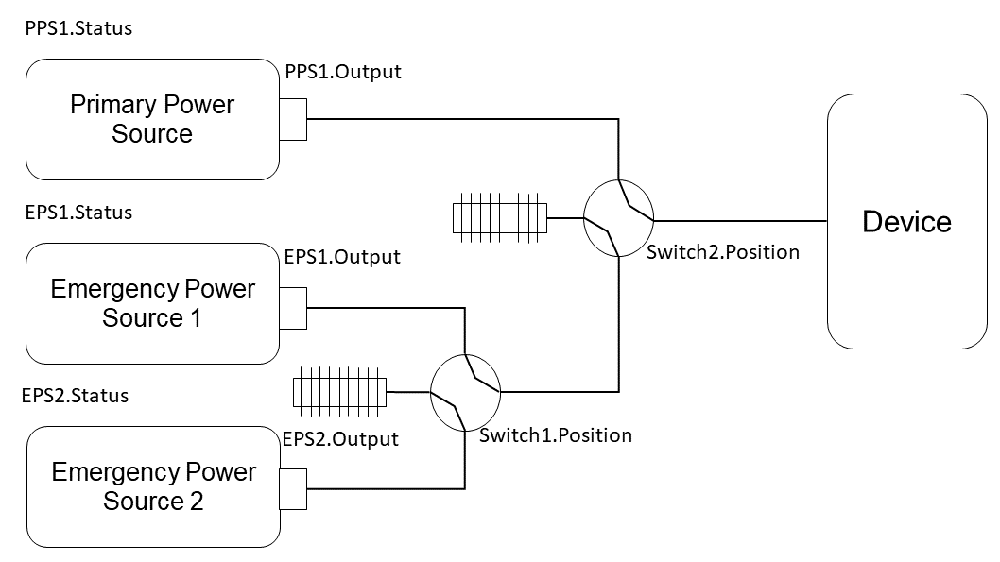

==== Overview
The eu.dariolucia.reatmetric.scheduler module provides the implementation of a scheduler with three main functionalities:

* Schedule activity executions with time-related triggers (absolute time, relative time to other scheduled activities
with optional delay);
* Schedule activity executions with event-related triggers, i.e. activities that are dispatched when a specific event is
raised by the processing model;
* Schedule activity executions based on state machine transitions (called 'bots').

For all these types of scheduling strategies, the ReatMetric scheduler handles resources and conflicts:

* When a schedule request is sent to the scheduler via the load(...), schedule(...) or update(...) method, the request
must have a set of resources linked to it. From a scheduling point of view, a resource is simply a string, identifying
the resource. The set of resources can be empty: this means that the scheduled activity does not declare any resource as
needed for its execution.
* A conflict can materialize:
** At insertion time: each insertion/update method for scheduling request foresees the provision of a CreationConflictStrategy
specification (an enumeration): such strategy tells the scheduler what to do in case of conflict.
** At execution time: each scheduling request must provide an indication of what to do, when the scheduled activity should
be triggered, but one of the declared resources is declared by a different scheduled activity that is currently running.

The CreationConflictStrategy can be applied only for the scheduling of activities whose scheduling
trigger is time-related:

* ABORT: Abort the complete operation if there is a resource conflict: the schedule is unmodified
* SKIP_NEW: Do not add the new activity if a resource conflict exists
* REMOVE_PREVIOUS: Remove the resource-conflicting scheduled items before adding the new activity
* ADD_ANYWAY: Add the activity anyway, with the risk of having problems later

The ConflictStrategy, defined per scheduling request or activity invocation (in case of bots), is applied to all activities
that are triggered and should start the execution:

* WAIT: Wait until the latest invocation time (if present) or indefinitely (if not present). Start as soon as the resources
are freed.
* DO_NOT_START_AND_FORGET: Do not invoke the activity and forget about its execution. The activity is basically skipped.
* ABORT_OTHER_AND_START: Abort ALL activities that are holding up the required resources, and then start the activity.

If the scheduled activity is triggered to start and the declared resources are available, the resources are acquired and
the activity is requested to the processing model to be dispatched.

Even if there is no compile-time dependency, the Scheduler implementation of this module requires an implementation of
several ReatMetric interfaces, in order to be instantiated and started.

The introduction to the so-called 'bots' require an ad-hoc paragraph. Bots are used to request automated activity
invocations depending on changes of state of the monitored systems. Each bot contains a formalized description of the
different states of interest of a system, in the form of a list of states. Each state contains:

* A list of criterium targeting a parameter, each of them evaluating to a boolean: true or false; different parameters
can be used.
* A list of activities to be invoked.

When the bot is initialised, it will go through the defined states one by one, according to the definition order, and it
will evaluate each criterium linked to the state. If the criteria defined for a specific state are all evaluated to true,
the bot state is assigned to that state, and it stops evaluating the remaining states. The actions assigned to the new
state are executed, if the bot is configured to do so (BotProcessingDefinition executeOnInit set to true).

When any of the monitored parameters in the list of criterium for all states change, the bot will evaluate again the
criteria defined for the current state. If all criteria evaluate again to true, there will be no change in the state.
Otherwise, the bot will start again evaluating the states one by one, according to the definition order, until it will
find a new matching state and perform the transition. If there is no matching state, no transition will be performed.

The function can be better understood with an example. Let's assume that a device could be powered up by three
independent power supplies (a primary power source and two emergency power sources, selected by a switch). There is a
second switch that selects which powerline must be used to power up the device. Each power source output can be enabled
or disabled, and they should be disabled if not used. The device has an internal capacitor to allow short power breaks in the order of few seconds.

A bot can be configured to automatically handle the necessary commands to enable/disable outputs and change switch
positions, depending on the status of the power sources. In order to do that, we define the following bot states:

[cols="1,2,2"]
|===
|State name|Criteria|Activities

|Nominal
|PPS1.Status == "ACTIVE"
|Switch2.Set_Position("UP")

PPS1.Set_Output("ON")

EPS1.Set_Output("OFF")

EPS2.Set_Output("OFF")

|Degraded 1
|EPS1.Status == "ACTIVE"
|Switch2.Set_Position("DOWN")

Switch1.Set_Position("UP")

EPS1.Set_Output("ON")

PPS1.Set_Output("OFF")

EPS2.Set_Output("OFF")

|Degraded 2
|EPS2.Status == "ACTIVE"
|Switch2.Set_Position("DOWN")

Switch1.Set_Position("DOWN")

EPS2.Set_Output("ON")

PPS1.Set_Output("OFF")

EPS1.Set_Output("OFF")

|===

At system start-up, the bot will initialise itself to a state (let's assume "Nominal") and, if so configured, it will
execute the configured activities. If there is any variation of any parameter configured in the Criteria column, then
the bot will re-evaluate its state. What it is important to see, is that the re-evaluation of the states will always
start from the current state first, and only if the criteria of the current state are not satisfied anymore, the bot
will evaluate the list of states from the beginning. This strategy avoids oscillating state transitions, i.e. moving
from one state to the other very quickly.

With reference to the example, as soon as the bot enters the "Degraded 1" state, it will stay in that state as long as
the emergency power source 1 stays active, no matter what happens to the primary power source status.

==== Configuration
To be written