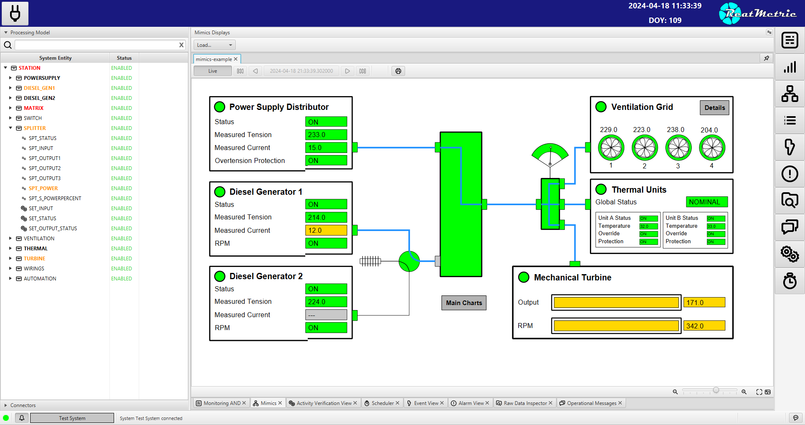

=== Overview
The eu.dariolucia.reatmetric.ui module provides an implementation of a graphical User Interface (UI) to operate a
ReatMetric system. In terms of technology, it is primarily based on JavaFX.

Depending on the deployment configuration, the ReatMetric UI can be deployed with an embedded ReatMetric backend, or it
can be used to remotely connect to a backend running on a separate host, via a ReatMetric Remoting Connector.

The UI is very intuitive to use and it is composed by five main areas.

* The top level bar, containing the button to connect to and disconnect from configured ReatMetric systems, the system
clock and the information about the UI version.
* The right panel, containing the buttons to open the various displays in the main display area of the UI.
* The left panel, which contains two areas:
** The hierarchical view of the processing model.
** The list of connectors registered in the system.
* The bottom toolbar, which contains:
** An indicator (green, orange, red) to display the initialisation status of the back-end and, by pressing on it, debug
information of the back-end processing status.
** An indicator with the name of the connected system, which blinks in case of outstanding alarms. By pressing on it, a
display shows the outstanding alarms, and provides a way to selectively acknowledge them.
** A system message label and a progress bar, for long running operations.
** A button to open the chat window.
* The main display area, where the different displays are opened upon click on the right panel button.

ReatMetric UI provides several displays to visualise specific aspects of the connected ReatMetric system. All displays
can work in live as well as in historical mode and are detachable. The displays are:

* AND Displays, showing a set of parameters, partitioned in groups, with related value, alarm state, validity.
* Mimics Displays, showing the rendering of real-time updated SVG-based mimics.
* Chart/Plot Displays, showing line, area, bar and scatter charts (for events).
* Parameter Log Display, showing all (or filtered) parameter samples as processed by the processing model.
* Alarm Log Display, showing all (or filtered) alarms as generated by the processing model.
* Event Log Display, showing all (or filtered) events as raised by the processing model.
* Raw Data Display, showing all (or filtered) raw data distributed in the system by the raw data broker.
* Message Display, showing all (or filtered) messages distributed in the system by the operational message broker.
* Activity Display, showing all activities and related verification stages as managed by the processing model.
* Schedule Display, showing all scheduled activities and bots as managed by the scheduler.

This module has the following dependencies:

* On eu.dariolucia.reatmetric.api

This module has the following external dependencies:

* On JavaFX libraries, as main UI library.
* On ControlsFX, for add-ons and enhancements built on top of JavaFX.
* On json-path library, since the storage of AND and chart displays is in JSON format.
* On eu.dariolucia.jfx.timeline, for the timeline chart rendering of the Scheduler Display View.

=== Start-up

It is assumed that all depending modules are located inside the "deps" folder in the current working directory, from
where the ReatMetric UI is started.

In case of ReatMetric system embedded in the UI, the command line to start the UI are the followings:

(Windows)

----
    java
    --module-path="deps"
    -Dreatmetric.core.config=<path to ReatMetric>\configuration.xml
    --add-exports javafx.base/com.sun.javafx.event=org.controlsfx.controls
    -m eu.dariolucia.reatmetric.ui/eu.dariolucia.reatmetric.ui.ReatmetricUI
----

(Linux)

----
    java
    --module-path="deps"
    -Dreatmetric.core.config=<path to ReatMetric>/configuration.xml
    --add-exports javafx.base/com.sun.javafx.event=org.controlsfx.controls
    -m eu.dariolucia.reatmetric.ui/eu.dariolucia.reatmetric.ui.ReatmetricUI
----

In case of ReatMetric system running on a separate host, the command line to start the UI are the followings:

(Windows)

----
    java
    --module-path="deps"
    -Djava.rmi.server.hostname=<server IP to use for local connections>
    -Dreatmetric.remoting.connector.config=<path to ReatMetric remoting>\configuration.xml
    --add-exports javafx.base/com.sun.javafx.event=org.controlsfx.controls
    -m eu.dariolucia.reatmetric.ui/eu.dariolucia.reatmetric.ui.ReatmetricUI
----

(Linux)

----
    java
    --module-path="deps"
    -Djava.rmi.server.hostname=<server IP to use for local connections>
    -Dreatmetric.remoting.connector.config=<path to ReatMetric remoting>/configuration.xml
    --add-exports javafx.base/com.sun.javafx.event=org.controlsfx.controls
    -m eu.dariolucia.reatmetric.ui/eu.dariolucia.reatmetric.ui.ReatmetricUI
----

In case the CSS stylesheet requires updates for UI customisation, the UI application must be started with the following VM option:

----
    -Dreatmetric.css.default.theme=<path to CSS file>
----

Two examples of such file (which can be copied and modified) can be found inside the reatmetric.ui module,
src/main/resources/eu/dariolucia/reatmetric/ui/fxml/css. If no property is specified, the UI application will start
with the reatmetric_clear.css theme by default, which in turns uses the standard OpenJFX CSS file Modena.css. The latest
version of such file can be found by following this link:
https://github.com/openjdk/jfx/blob/master/modules/javafx.controls/src/main/resources/com/sun/javafx/scene/control/skin/modena/modena.css

The file contains a lot of explanations. To make a customisation, it is enough to overwrite the desired property in the
custom CSS file. Example: the reatmetric_dark style overwrites the property -fx-base of the class .root. This property
is used by the Modena style to derive all the gradients of background automatically.

The reference guide for OpenJFX styling is provided here:
https://openjfx.io/javadoc/19/javafx.graphics/javafx/scene/doc-files/cssref.html

=== Configuration

The UI does not require specific configuration. During its execution, it stores specific user preferences inside the
folder $HOME/Reatmetric UI. Artefacts such as ANDs and charts/plots can be created directly via the UI. The only artefacts
that require external preparation are the mimics. ReatMetric mimics are built by means of SVG files. In order to link the
defined SVG elements to parameters, ReatMetric prescribes the use of custom data-* SVG attributes.

The attributes defined and/or used by ReatMetric, their meaning and the expected syntax value are  listed in this section.

==== Condition-Expression

Unless differently specified, ReatMetric custom attributes contains 'condition-expression' values. A
condition-expression value is a string, composed by (guess eh..) a condition and an expression.

`condition-expression ::= [<condition>' ']':= '<expression>`

A condition is a single boolean expression, which is composed by a reference, a boolean operator and a
reference value. If it is omitted, then it is assumed that the condition is always met (i.e. is always
evaluated to _true_).

`<condition> ::= <reference>' '<operator>' '<reference value>'`

A reference can be one of the followings:

`<reference> ::= '$eng'|'$raw'|'$alarm'|'$validity'`

$eng is the engineering value of the bound parameter
$raw is the raw (source) value of the bound parameter
$alarm is the global alarm state of the bound parameter
$validity is the validity state of the bound parameter

`<operator> ::= LT|GT|LTE|GTE|EQ|NQ`

`<reference value> ::= any string literal (parameter reference-type dependant)|'\\##NULL##'`

Depending on the selected reference, ReatMetric can infer the correct type and can apply the correct
comparison function to the derived values. To indicate the null value, the following reserved string
must be used: _\\##NULL##_

`<expression> ::= any string literal (SVG attribute dependant)`

An expression exact value depends on the SVG attribute and the allowed values are described in this
documentation. For instance, the _data-rtmt-visibility-00_ attribute accepts as expression either the
string _visible_ or the string _hidden_. However, the ReatMetric framework allows to use $eng, $raw,
$validity and $alarm also in expressions: the placeholder is replaced with the correct value if the
transformation must be applied.

Some examples of condition-expression values are provided hereafter.

`data-rtmt-fill-color-00="$alarm EQ WARNING := #AA3344FF"`

Explanation: if the alarm state is WARNING, set the fill color to #RGBA.

`data-rtmt-visibility-00="$validity EQ INVALID := hidden"`

Explanation: if the validity is INVALID, set the visibility to hidden (SVG element is not displayed).

`data-rtmt-text-00="$validity EQ VALID := $eng"`

Explanation: if the validity is VALID, set the text of the SVG element to the engineering value of the
parameter.

==== Attributes

*data-rtmt-binding-id*

This attribute contains the path of the parameter that is bound to the SVG element.
This attribute is mandatory.

`Example: data-rtmt-binding-id="ROOT.ELEMENT.PARAM1"`

*data-rtmt-visibility-[nn]*

This attribute is used to set the visibility of the SVG element. Its value is defined by a ReatMetric
condition-expression.
This attribute can be present several times attached to a single SVG element. If so, such attribute list
is evaluated in lexicographical order. As soon as one item's evaluation is successful, the list evaluation
stops.

Allowed expression values: _collapse_, _hidden_ or _visible_. Null value _\\##NULL##_ removes the attribute.

*data-rtmt-fill-color-[nn]*

This attribute is used to set the fill color of the SVG element. Its value is defined by a ReatMetric
condition-expression.
This attribute can be present several times attached to a single SVG element. If so, such attribute list
is evaluated in lexicographical order. As soon as one item's evaluation is successful, the list evaluation
stops.

Allowed expression values: \#RRGGBBAA. Null value _\##NULL##_ removes the attribute.

*data-rtmt-stroke-color-[nn]*

This attribute is used to set the stroke color of the SVG element. Its value is defined by a ReatMetric
condition-expression.
This attribute can be present several times attached to a single SVG element. If so, such attribute list
is evaluated in lexicographical order. As soon as one item's evaluation is successful, the list evaluation
stops.

Allowed expression values: \#RRGGBBAA. Null value _\##NULL##_ removes the attribute.

*data-rtmt-stroke-width-[nn]*

This attribute is used to set the stroke width of the SVG element. Its value is defined by a ReatMetric
condition-expression.
This attribute can be present several times attached to a single SVG element. If so, such attribute list
is evaluated in lexicographical order. As soon as one item's evaluation is successful, the list evaluation
stops.

Allowed expression values: a real number. Null value _##NULL##_ removes the attribute.

*data-rtmt-width-[nn]*

This attribute is used to set the width of the SVG element. Its value is defined by a ReatMetric
condition-expression.
This attribute can be present several times attached to a single SVG element. If so, such attribute list
is evaluated in lexicographical order. As soon as one item's evaluation is successful, the list evaluation
stops.

Allowed expression values: a real number. Null value _\\##NULL##_ removes the attribute.

*data-rtmt-height-[nn]*

This attribute is used to set the height of the SVG element. Its value is defined by a ReatMetric
condition-expression.
This attribute can be present several times attached to a single SVG element. If so, such attribute list
is evaluated in lexicographical order. As soon as one item's evaluation is successful, the list evaluation
stops.

Allowed expression values: a real number. Null value _\\##NULL##_ removes the attribute.

*data-rtmt-text-[nn]*

This attribute is used to set the text of the SVG element. Its value is defined by a ReatMetric
condition-expression. It can be attached only to SVG _<text>_ elements. _<text>_ elements shall not contain
any _<tspan>_ element, as it is not supported.
This attribute can be present several times attached to a single SVG element. If so, such attribute list
is evaluated in lexicographical order. As soon as one item's evaluation is successful, the list evaluation
stops.

Allowed expression values: any string. Null value _\\##NULL##_ is treated as empty string.

*data-rtmt-transform-[nn]*

This attribute is used to set the transformation of the SVG element. Its value is defined by a ReatMetric
condition-expression.
This attribute can be present several times attached to a single SVG element. If so, such attribute list
is evaluated in lexicographical order. As soon as one item's evaluation is successful, the list evaluation
stops.

Allowed expression values: string, syntax as per https://developer.mozilla.org/en-US/docs/Web/SVG/Attribute/transform.
Null value _\\##NULL##_ removes the attribute.

*data-rtmt-blink-[nn]*

This attribute is used to set whether an SVG object shall blink. Its value is defined by a ReatMetric
condition-expression.
This attribute can be present several times attached to a single SVG element. If so, such attribute list
is evaluated in lexicographical order. As soon as one item's evaluation is successful, the list evaluation
stops.

Allowed expression values: #RRGGBBAA or _none_ to disable blinking.

If set to a colour, the fill attribute value is taken from the specified color and the tone is decreased by half. The
_animate_ tag attached to the SVG element is (example):

`<animate attributeType="XML" attributeName="fill" values="#800;#f00;#800;#800" dur="1.0s" repeatCount="indefinite"/>`

*data-rtmt-rotate-[nn]*

This attribute is used to set whether an SVG object shall rotate. Its value is defined by a ReatMetric
condition-expression.
This attribute can be present several times attached to a single SVG element. If so, such attribute list
is evaluated in lexicographical order. As soon as one item's evaluation is successful, the list evaluation
stops.

Allowed expression values: `<rotation time in milliseconds> <rotation center x> <rotation center y>` or `none` to disable the rotation.

==== Actions

Actions can be linked to SVG elements by means of the `onclick` attribute. In addition to the standard javascript functions,
ReatMetric mimics can use the following functions.
In order to indicate the presence of a clickable action, it is suggested to also use the attribute `cursor=pointer`.

*reatmetric.and('name')*

Open the specified AND.

*reatmetric.chart('name')*

Open the specified chart.

*reatmetric.mimics('name')*

Open the specified mimics.

*reatmetric.exec('path')*

Open the dialog window to request the execution of the specified activity.

*reatmetric.set('path')*

Open the dialog window to request the set of the specified parameter.
